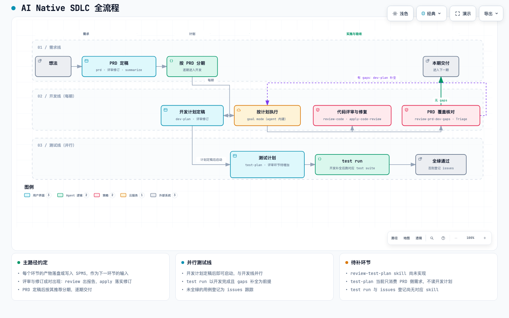

# AI Native SDLC：用 XGENT Skills 串起从想法到交付的流水线

本文描述一套 AI 驱动的软件交付流程：从一个想法出发，由本仓 `skills/` 中的一组 skill 接力完成需求、计划、开发、评审、测试与交付。每个环节的产物——落盘文件或 SPMS 实体——是下一环节的唯一输入。本文面向用这套 skill 做交付的工程师与 agent：说明流程怎么走、每个产物放在哪、以及流程目标与 skill 现状之间的差距。

## 快照信息

| 项 | 值 |
| --- | --- |
| 仓库 | https://github.com/XGENT-ai/skills.git |
| 分支 / 提交 | `main` / `0a5b550`（2026-10-02） |
| 许可证 | MIT（`LICENSE`） |

## 1 全流程概览

需求阶段一次性走完；PRD 定稿后按其推荐分期，逐期交付。每期内开发线是主路径，测试线在开发计划定稿后并行启动，在开发补全 gaps 之后汇合做整体验收。

交互版：[diagrams/ai-native-sdlc.html](diagrams/ai-native-sdlc.html)，用浏览器打开，可缩放、搜索、追踪路径。图源文件为 `diagrams/ai-native-sdlc.json`，改图从它改。

贯穿全程的两条约定：

- **评审与修订成对出现**：`review-*` 只出评审报告、不改原文；`apply-*-review` 按报告逐条落实修订并回写处置结果。
- **产物驱动衔接**：环节之间只认产物（文件路径、SPMS key），不认对话记忆；产物路径约定见第 6 节。

## 2 需求阶段（一次性）

| 顺序 | 环节 | skill | 输入 → 产物 |
| --- | --- | --- | --- |
| 1 | 写 PRD | [prd](../skills/prd/SKILL.md) | 想法、约束 → `docs/PRD-<代号>.md` + SPMS `FR-N`/`NFR-N`（一律 `draft`） |
| 2 | 评审 PRD | [review-prd](../skills/review-prd/SKILL.md) | PRD + 代码仓现状 → `<PRD 文件名>.review.md`（与 PRD 同目录） |
| 3 | 按评审修订 | [apply-doc-review](../skills/apply-doc-review/SKILL.md) | PRD + 评审报告 → 修订后的 PRD，报告内追加处置与复核节 |
| 4 | 需求解读报告 | [summarize](../skills/summarize/SKILL.md) | PRD → HTML 报告提交 SPMS 项目「报告」Tab（`kind=prd_interpretation`），得 `RPT-N` |

第 2、3 步可循环，直到评审通过。PRD 同时承担两个下游的输入：交给 dev-plan 的是 **`FR-N`/`NFR-N` key 的集合**（不是整份文档，PRD 与计划多对多），交给 test-plan 的是同一组 key 加逐行验收标准与 UAT 预期状态（`skills/prd/SKILL.md:199`、`skills/prd/SKILL.md:203`）。评审报告的路径优先级为「用户指定 → PRD 同目录 `<PRD>.review.md` → 工作区 `docs/reviews/<主题短名>.review.md`」（`skills/review-prd/references/report-contract.md:6`）；apply-doc-review 按报告来源路由到待修文档（`skills/apply-doc-review/SKILL.md:18`）。summarize 的链路固定为「取素材 → 调 elintp 生成 → 查重 → `report_submit`」（`skills/summarize/SKILL.md:13`）。

## 3 分期

prd 在 PRD 末尾给出分期建议与终验期。PRD 定稿后按分期逐期进入第 4 节的开发循环；分期是交付节奏单位，不是需求拆分单位——一份 PRD 可拆给多份计划，多份 PRD 的需求也可合并进一份计划，关联只靠 `FR-N`/`NFR-N` key（`skills/prd/SKILL.md:181`）。

## 4 每期 · 开发线（主路径）

| 顺序 | 环节 | 执行者 | 输入 → 产物 |
| --- | --- | --- | --- |
| 1 | 写开发计划 | [dev-plan](../skills/dev-plan/SKILL.md) | 该期 `FR-N`/`NFR-N` key 集合（作计划的 `R1..Rn`）→ `goal/<代号>.md`（目标仓根有 goal 目录时）或 `docs/plan/<代号>.md`；SPMS 侧 `plan_create` → `PLAN-N` |
| 2 | 评审计划 | [review-dev-plan](../skills/review-dev-plan/SKILL.md) | 计划 + 关联需求 + 代码仓 → `<计划文件名>.review.md`（与计划同目录） |
| 3 | 按评审修订 | [apply-doc-review](../skills/apply-doc-review/SKILL.md) | 计划 + 评审报告 → 修订后的计划。**计划定稿后测试线（第 5 节）并行启动** |
| 4 | 按计划执行 | agent goal mode（内建，非 skill） | 计划 → 代码变更 + `<计划>.records/M<n>.md` 里程碑实现记录 |
| 5 | 评审代码 | [review-code](../skills/review-code/SKILL.md) | 未提交变更 / commit / 分支差异 + 计划 → `<计划名>.code-review.md` |
| 6 | 按评审修复 | [apply-code-review](../skills/apply-code-review/SKILL.md) | 计划 + 代码评审报告 → 修复 + 回写 records 与计划进度快照 |
| 7 | 开发总结报告 | [summarize](../skills/summarize/SKILL.md) | 计划及其交付 → HTML 报告（`kind=dev_plan_summary`），得 `RPT-N` |
| 8 | PRD 覆盖核对 | [review-prd-dev-gaps](../skills/review-prd-dev-gaps/SKILL.md) | PRD + 已完成计划及 records → `<计划名>.prd-dev-gaps.md` 差异报告 |
| 9 | 补全 gaps | [dev-plan](../skills/dev-plan/SKILL.md)（由第 8 步调用） | 差异报告 + 决策账本 → gaps plan（默认代号 `<原计划名>-gaps`），回到第 4 步 |

第 4 步说明：goal execution 由 coding agent 内建的 goal mode（目标模式，如 Kimi Code 的 /goal 命令）承担——把定稿计划作为目标交给 agent，由 goal mode 持续推进直到完成判定；它是 agent 运行时能力，不是仓内 skill。计划文件自带实施合同：实施者直接读计划顶部的「实施须知」「实施者定位」「实施进度」两节，不加载 dev-plan skill（`skills/dev-plan/SKILL.md:12`）；进度校验命令、进度回写、subagent 并行等约定都写在这两节里，在 goal mode 下照常生效。计划落盘的 `goal/<大写代号>.md` 目录约定（`skills/prd/SKILL.md:227`）与 goal mode 同名，前者是路径约定，后者是执行机制。计划路径优先级、状态（`Ready`/`Blocked`/`Proposed`）与 records 格式分别见 `skills/dev-plan/SKILL.md:39`、`skills/dev-plan/SKILL.md:42`、`skills/dev-plan/SKILL.md:43`。

第 8 步把差异分三类（`skills/review-prd-dev-gaps/SKILL.md:41-43`）：A 明确遗漏（直接进 follow-up）、B 合理变更（有依据，保留）、C 需 Triage 的实现差异。C 类用问题卡逐轮交互提问，用户决策记入决策账本（`skills/review-prd-dev-gaps/SKILL.md:54-65`）；未决的 C 不得作为已选方案进入计划。follow-up 清单非空时实际调用 dev-plan 生成独立 gaps plan（`skills/review-prd-dev-gaps/SKILL.md:74-76`），默认到计划交付为止、不开始执行（`skills/review-prd-dev-gaps/SKILL.md:78`）；全部无 follow-up 时报告写「无需 gaps plan」（`skills/review-prd-dev-gaps/SKILL.md:73`），本期交付完成，进入下一期。

## 5 每期 · 测试线（并行）

测试线在开发计划定稿（第 4.3 步）后启动，与开发线并行；最后的 test run 以开发完成且 gaps 补全为前提。

| 顺序 | 环节 | 执行者 | 输入 → 产物 | 状态 |
| --- | --- | --- | --- | --- |
| 1 | 写测试用例 | [test-plan](../skills/test-plan/SKILL.md) | 需求 key 的 PRD 正文 + 逐行验收标准（AC1..ACn）+ UAT 预期状态 → SPMS `TC-N`（`draft`，`result` 服务端默认 `untested`） | 可用，输入范围与目标流程有差距，见第 7 节 |
| 2 | 评审测试计划 | review-test-plan | 测试计划 → 评审报告 | [TODO] skill 不存在 |
| 3 | 按评审修订 | [apply-doc-review](../skills/apply-doc-review/SKILL.md) | 测试计划 + 评审报告 → 修订后的测试计划 | [TODO] 未接通，见第 7 节 |
| 4 | 测试计划报告 | [summarize](../skills/summarize/SKILL.md) | 测试计划 → HTML 报告，`RPT-N` | 可用（`kind` 无测试计划专属取值，用 `other`） |
| 5 | test run | 人工 / CI [ASK USER] | 该 dev-plan 对应的 test suite（区别于开发过程自用的 fixture）→ 全绿通过；未全绿登记 issues 跟踪 | [TODO] 无对应 skill，约定待确认 |

test-plan 的现状边界：用例只写 SPMS、不落盘文件；评审用例、转 `active`、执行、回填 `result` 是人的动作（`skills/test-plan/SKILL.md:21`、`skills/test-plan/SKILL.md:98`）；创建时必带 `requirementKey` 关联需求、不传 `result`（`skills/test-plan/SKILL.md:87-91`）。

## 6 产物交接一览

| 产物 | 位置 | 生产者 → 消费者 |
| --- | --- | --- |
| `docs/PRD-<代号>.md` + `FR-N`/`NFR-N` | 目标仓 `docs/` + SPMS | prd → review-prd、dev-plan、test-plan、review-prd-dev-gaps |
| `<PRD>.review.md` | PRD 同目录 | review-prd → apply-doc-review |
| `goal/<代号>.md` 或 `docs/plan/<代号>.md` + `PLAN-N` | 目标仓 + SPMS | dev-plan → review-dev-plan、实施者、review-code、review-prd-dev-gaps |
| `<计划>.review.md` | 计划同目录 | review-dev-plan → apply-doc-review |
| `<计划>.records/M<n>.md` | 计划旁 | 实施者、apply-code-review → review-prd-dev-gaps |
| `<计划名>.code-review.md` | 计划同目录 | review-code → apply-code-review |
| `<计划名>.prd-dev-gaps.md` | 计划旁 | review-prd-dev-gaps → 用户 Triage、dev-plan |
| `<原计划名>-gaps` 计划 | 同 dev-plan 路径约定 | dev-plan（经 review-prd-dev-gaps 调用）→ 实施者 |
| `TC-N` | SPMS | test-plan → 测试人员评审、执行 |
| `RPT-N` | SPMS 项目「报告」Tab | summarize → 项目成员 |

## 7 流程目标与 skill 现状的差距

第 2、4 节描述的环节在当前 commit 全部可用。测试线（第 5 节）有四处以目标流程为准、现状未到的差距，已逐条核对：

1. **review-test-plan 不存在** [TODO]。已核对：`skills/`（48 个目录）、`local/`、`.agents/skills/` 中均无此 skill，全仓无 `review-test-plan` 引用。
2. **test-plan 不消费 dev-plan 产物**。已核对：其输入是 `requirement_get(key)` 取回的需求正文与逐行验收标准（`skills/test-plan/SKILL.md:47-51`），与 prd 的交接清单（`skills/prd/SKILL.md:203`）一致，全文无开发计划输入。流程描述中的「prd & dev-plan」是目标态；现状下「需要定稿的 dev-plan 才启动测试线」只是节奏约定，不是数据依赖。
3. **测试计划的评审-修订环未接通** [TODO]。apply-doc-review 的路由只认 review-prd 与 review-dev-plan 两类报告（`skills/apply-doc-review/SKILL.md:18-19`），且 test-plan 的产出在 SPMS、不落盘，没有评审报告可以修订的原文文件。接通它需要先定 test-plan 的落盘形态。
4. **test run 与 issues 登记无对应 skill** [TODO]。仓内没有执行测试套件或登记 issue 的 skill；SPMS 侧有 issue 实体（summarize 可用 `issue_get` 读 `TKT-N`/`BUG-N`，`skills/summarize/SKILL.md:25`），但「红灯登记 issues」的动作目前没有自动化承接。

另有一处命名需要澄清：第 4.4 步的 goal execution 指 coding agent 内建的 goal mode，不是仓内 skill，也与 agi-mode 无关——agi-mode 是另一套自主任务模式，与本流水线互不引用。

## 8 待确认问题

1. [ASK USER] test run 的 test suite 如何组织（目录、命名、运行命令），「对应 dev-plan」的关系如何标记？
2. [ASK USER] 未全绿时 issues 登记到哪里：SPMS issue（`TKT-N`/`BUG-N`）还是代码托管平台的 issue？
3. [ASK USER] 测试线的 summarize 报告 `kind` 是否需要新增测试计划专属取值？现状只有 `prd_interpretation` / `dev_plan_summary` / `other`（`skills/summarize/SKILL.md:63-67`）。

## 依据文件

| 文件 | 证明了什么 |
| --- | --- |
| `skills/prd/SKILL.md` | PRD 落盘与 SPMS 录入、对 dev-plan / test-plan 的交接单位、分期与 goal 目录约定 |
| `skills/review-prd/references/report-contract.md` | PRD 评审报告路径约定 |
| `skills/apply-doc-review/SKILL.md` | 文档评审报告 → 原文的路由 |
| `skills/summarize/SKILL.md` | 报告生成与 `report_submit` 链路、`kind` 取值、SPMS issue 实体 |
| `skills/dev-plan/SKILL.md` | 计划落盘、状态、records 协议、「实施者不加载 skill」的执行约定 |
| `skills/review-dev-plan/references/report-contract.md` | 计划评审报告路径约定 |
| `skills/review-code/references/report-contract.md` | 代码评审报告路径约定 |
| `skills/apply-code-review/references/record-contract.md` | 修复后 records 与进度快照的回写约定 |
| `skills/review-prd-dev-gaps/SKILL.md` | 差异三分类、交互 Triage、gaps plan 的生成与边界 |
| `skills/test-plan/SKILL.md` | 测试用例的输入、SPMS 写入契约与人的责任分界 |
