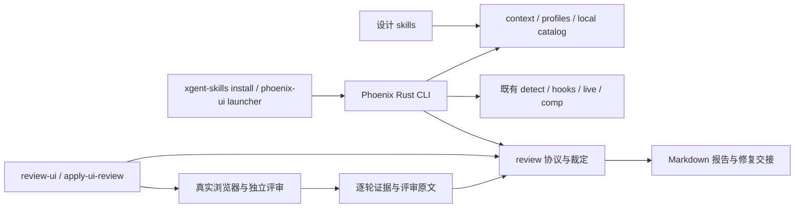

# PHOENIX-UI · XGENT Phoenix UI · 独立设计工具与 UI 验收闭环（Rust CLI + 设计 skills）

> **实施须知：直接依据本计划、仓库规则和当前代码实施或续做。** 先读下方「实施者定位」「实施进度」，核对工作树，再按相关正文与里程碑推进、验证、回写进度并按约定提交；使用 goal 执行时也遵循这些约定。
>
> **计划状态：Ready**
>
> 调查基线：2026-10-08 · `b2289fa05f1e4f0251bc3a86e3c04f182aba156e` · 当前工作树 dirty（计划、评审与状态台账未提交）；代码事实以当前工作树及明确标注的固定上游源码为准。
>
> 需求来源：用户需求，无 PRD。用户 2026-10-08 确认先承接 Impeccable 功能，再逐步加入自有偏好；使用 mise 的 Rust 1.99，通过 mbx build 构建并共享缓存。
>
> 本期交付：**XGENT 自主维护的 Phoenix UI Rust 运行时、设计 skill、安装迁移工具，以及与 design skills / review-ui loop 共用的上下文与证据契约。**
> 本期独特职责：承接现装 Impeccable 的可用设计能力，把版本、规则和发布控制权收回 XGENT，再将已有 UI 验收规则落实为可复现的工具行为。
> **顶层排除：重写已有 Rust 检测引擎、复制上游营销网站或插件市场、把自动扫描分数当作 UI 验收、自动批准目标变更或用户豁免。**

## 实施者定位

执行本计划的 agent 是**资深软件工程师**，依据本计划、仓库规则和当前代码实施。

- **表达与源码**：报告用路径、需求/检查/里程碑 ID 定位，不复述计划。源码不放需求编号、agent 标记或规划元数据，注释解释必要原因；追溯放记录或提交说明。
- **编号与任务**：需求/约束/假设 ID 只在需求账本登记一次，上游 ID 保留原编号及来源；检查、里程碑、任务 ID 分别由验证表、里程碑表、按需内部任务表定义，正文、NFR 展开、映射和进度记录只引用。修订保留已有 ID，删除/拆分时同步引用；任务表若存在，按交付物、前置成果与检查 ID 推进，任务进展及证据写入所属里程碑记录，不另设任务状态表。
- **完成的定义**：本里程碑退出检查全部通过才能记完成；未运行、失败、环境缺失分别记缺口，不冒充通过。集中到阶段收口的终验由收口里程碑负责，通过前不宣称整期或跨期需求已验收。
- **工作顺序**：需要行为测试的改动先红、再绿、再重构。按实际前置成果及检查推进，不等无关终验，数据、安全、发布及用户分期门不得绕过；稳定契约下可用 fixture 开发，不能替代真实集成。按 §9 执行局部检查与集中验收，同环境走查可合并；相关代码、配置、依赖、输入与环境未变可引用已通过证据，否则重跑受影响检查，收口仍跑必要集成回归。
- **并行交付**：独立任务在收益超过委派/集成成本且工具可用时使用 subagents，模型默认继承。任务说明只给目标/ID、稳定契约、可写与禁改路径、运行资源和检查；共享文件单人负责，数据库、端口、浏览器等隔离或串行。子 agent 返回结果、路径、验证证据与缺口，默认不另写任务文档；主 agent 审查并集成验收。边界变化先回报，失败只阻塞依赖任务；结束对话前收集或停止仍在运行的任务。

## 实施进度（实施期持续更新）

本节是本计划跨对话恢复的**唯一汇总入口**，协议文字不随实施改写，实施期只更新「恢复快照」和「完成记录」。续做时先读仓库规则、本节、当前任务相关正文与依赖，再核对 `git status` 和相关 diff；记录与工作树不符时先查明原因，不凭记录覆盖用户改动，也不凭代码存在推断验收已通过。只有继续未完任务、核验前置验收、排错或审查时，才按链接读取对应记录的相关部分；不要默认加载全部记录或原始日志。

**回写时机**：里程碑完成后立即回写，再报告完成或提交；下游只需部分成果时，所需前置检查通过并在记录保存证据即可推进。实质进展后受阻、暂停、交接、发现偏差或结束对话时也保存成果与缺口；普通子任务切换不单独回写。

**一次回写**：主 agent 更新对应记录，再同步快照变化字段和完成记录一行，不重写无变化内容或追加流水。快照写当前任务、进展与下一步，命令及证据只进记录。首次回写删占位行，每个已记进展的里程碑恰好一行，状态仅「进行中 / 阻塞 / 已完成」；完成时移至已完成行末，最近完成取该行。更新时间带时区，摘要 1–2 句，记录填相对计划的链接（如 `[M1 记录](FEATURE.records/M1.md)`）。范围、决策、接口、数据、风险或退出条件有偏差时，就地修订对应正文，不追加勘误历史。

**独立记录**：按需建 `<计划名>.records/M<n>.md`，头部写计划链接、更新时区、状态及验证基线（commit SHA；未提交写 dirty@起始SHA 与关键改动路径）。正文只写交付行为/路径、必要偏差、未完项与继续动作；验收按 `检查 ID/覆盖范围 | 命令或步骤 | 结果/必要证据` 记录，共同环境和基线在头部写一次，有差异再单列。同一测试组可覆盖多条退出条件，须逐条可追溯；引用原证据与复用依据，不复制断言全文、成功日志或调试流水。未运行、失败、环境缺失明确区分；只有复杂交接、排错或证据需独立保存时才另建任务记录/日志/截图并链接。

**项目跟进索引**：仓库已登记状态台账，或存在仓根 `.xgent-ai/sdlc/protocol.md` 时（兼容已有 `docs/project-status/protocol.md`；两套并存未切换时先核对，不双写），每次上述回写完成后，读取台账的回写规则（默认目录读上述协议）并追加本计划的实施变化记录，链接本节和对应验收记录，再刷新受影响对象状态页和必要索引；未启用则跳过。复用已有计划 ID，只更新本次触及的范围，保留其他计划和各轮评审；台账仅作项目索引，不替代本节的恢复快照。跨机器使用仓根相对路径与明确基线，未提交成果标明同步限制；登记失败说明缺口，不将原成果回退。

**提交**：在里程碑表后的「提交点」提交：里程碑较多时在标出的阶段收口后提交，全部里程碑完成后必须提交一次；仓库规则或用户对分支、提交信息、签名或是否由 agent 提交另有要求时从其要求。提交前先回写本次进度并通过该提交点要求的检查；只暂存本计划相关改动，不纳入、不回退他人改动，不跳过提交钩子。提交后把短 SHA 写入完成记录中本次覆盖的各里程碑行的「提交」列（代码评审修复的提交写作「修复」加短 SHA，UI 验收修复的提交写作「UI修复」加短 SHA，均追加在原 SHA 之后），再单独提交这次只改计划文件的更新，该提交不回填自己的 SHA。已完成但未到提交点的行写「待提交」；无法提交时写明原因并记入当前阻塞，不伪造 SHA。

**全部完成**：最后一个里程碑完成后，按上条完成最终提交并回写 SHA，确认每个已完成行的「提交」都有 SHA；恢复快照的「下一步」写代码评审。随后向用户报告完成，并提示下一步用 review-code 以本计划路径为参数评审本计划：它从完成记录找到要审的提交，并纳入未提交改动。评审由用户发起，实施中不自行启动评审或修复评审意见。

**回写后自查**：每次回写后直接核对以下条目：「当前进度 n/N」的 N 等于里程碑总数，n 只计状态为「已完成」的行；「最近完成」对应最后一条已完成记录，不按编号推算；链接指向已落盘文件；已完成行的「提交」是短 SHA 或「待提交」，全部完成时每行都有 SHA 且没有「待提交」。上述结构、计数与链接检查不证明验收真实通过。

### 恢复快照

- 最近更新：2026-10-09T20:00:48+08:00
- 当前进度：1/6 个里程碑完成
- 当前状态：进行中；第二次矩阵失败，Linux/Windows前置修复已本地验证，Mac清理失败待第三次CI诊断；M4已接受brief映射草稿保持隔离
- 最近完成：M1 · 固定来源与可运行基线
- 下一步：M2 · 正常推送同一已授权验证分支并运行第三次矩阵、读取Mac清理报告；成功矩阵后推进M3，M4保持隔离
- 当前阻塞：
- 代码基线：de3a85739ddc04c346c123e9b36ff86b177ec0b7（M2跨平台前置修复与Mac断言诊断候选；本地受影响检查通过，待第三次CI）

### 完成记录

| Milestone | 状态 | 更新时间 | 简要记录 | 实现与验收记录 | 提交 |
| --- | --- | --- | --- | --- | --- |
| M1 | 已完成 | 2026-10-08T19:12:49+08:00 | 固定来源、工具和真实迁移/Web 输入；原 build/测试/oracle/性能及既有失败已分型登记，V-2 一致性仍待 M2 关闭。 | [M1 记录](phoenix-ui.records/M1.md) | 待提交 |
| M2 | 进行中 | 2026-10-09T20:00:48+08:00 | 第二次矩阵五native失败、后置job跳过；Linux/Windows前置修复回归27项通过，Mac失败保持原断言并增加报告。当前Node184/Python59、Rust865行为、格式修正后lint/WASM8474/oracle860及Node18/25消费、审计通过，待第三次CI。 | [M2 记录](phoenix-ui.records/M2.md) | 候选实现 624147968ecc；CI修复候选 19630c25aa4e、de3a85739ddc；未到M3完成提交点 |
| M4 | 进行中 | 2026-10-09T20:00:48+08:00 | 独立worktree的context JSON、generic/Portal profile与接受brief路径映射15项测试先红后绿；原文/hash、漂移冲突和安全索引写入已局部验证。skill融合及安装后验收待实施，未纳入A树。 | [M4 记录](phoenix-ui.records/M4.md) | 未到M6完成提交点；隔离改动尚未提交 |

## 0. 需求、范围与决策

### 0.1 需求与约束账本

| ID | 类型 | 来源 | 内容 | 设计/验收落点 | 状态 |
| --- | --- | --- | --- | --- | --- |
| R-1 | 功能 | 用户：做自己的工具，不再跟随原版升级和变动 | 源码、版本、构建、分发、规则、默认运行链均由 XGENT 控制 | §1、§2、§5.1；V-1、V-2、V-3 | 已确认 |
| R-2 | 功能 | 用户：优先承接 Impeccable 功能 | 先承接现装版本的设计命令、检测、context、hooks、live、comp 等能力，再增加偏好；所有差异明列 | §1.2、§9；V-1、V-2、V-5 | 已确认 |
| R-3 | 功能 | 用户：与 design skill 深度融合 | design-reference、ui-pattern-research、design-md、Phoenix 实现能力共享上下文和明确职责 | §4.1、§5.2；V-6、V-9 | 已确认 |
| R-4 | 功能 | 用户：与 review-ui loop 深度融合 | 冻结目标、取证、独立评审、裁定、修复记录和复审可机械核对、跨对话恢复 | §3.2、§4.2、§5.3；V-7、V-8、V-9 | 已确认 |
| R-5 | 功能 | 用户：增加自己的偏好 | 项目可选自有规则与方向库；建议、已接受规范和实测事实分开，项目设计不会被默认口味覆盖 | §5.2；V-6、V-9 | 已确认 |
| R-6 | 功能 | 用户：从 install 替代当前工具 | 新装默认 Phoenix；旧项目预检、备份、切换、幂等、失败恢复与回滚；保留既有 hooks/settings | §3.1、§5.1、§8；V-3、V-4、V-5 | 已确认 |
| R-7 | 功能 | 用户：决定名称 | 采用 XGENT Phoenix UI；CLI/skill 名 phoenix-ui | §0.2、§6；V-10 | 设计选择 |
| R-8 | 功能 | 用户 2026-10-08 对在线方向库的答复 | 采用自有本地方向库，保留探索流程，不承诺复制原站全部素材 | §1.2、§5.2；V-2、V-6 | 已确认 |
| NFR-1 | 可靠性 | 安装器会改项目配置，评审会持久化跨轮证据 | 中断不丢原文件、不出现静默混装；报告和证据可追溯；冲突不得覆盖 | §3、§8；V-4、V-7、V-8 | 设计选择 |
| NFR-2 | 可维护性 | 用户：自主维护，统一 Rust 工具链和缓存 | 单一 skill 源、锁定依赖、native/WASM 规则一致、没有上游自动更新或隐藏下载 | §2、§7；V-1、V-2、V-3 | 已确认 |
| NFR-3 | 性能/磁盘 | 用户：mbx 共享 target cache，节省硬盘 | mbx 管理编译产物；不得私设每次构建的 target；同 fixture 对比启动/检测/hook 耗时和峰值 RSS | §7；V-1、V-5 | 数值基线待 M1 测量，不预设 SLA |
| NFR-4 | 本地数据与信任 | 上游包含本地服务、可写 live 接口、外部请求 | 保留本地服务访问控制；不上传代码、截图、规范或偏好；证据不能因退出码 0 自动变真 | §5、§7；V-2、V-4、V-7 | 设计选择 |
| C-1 | 技术约束 | 用户 2026-10-08 明确要求 | Rust 1.99.0，由 mise 管理；构建用 mbx build；项目不随上游 stable 漂移 | §2.2；V-1、V-3 | 已确认 |
| C-2 | 仓库约束 | AGENTS.md「Working in This Repository」 | skills/ 是唯一源；接口变化同步 README、SDLC 路由、现有 agent 元数据与引用；总入口 npm test | §1.3、§4.3；V-9、V-10 | 已确认 |
| C-3 | 分发兼容 | package.json；bin/xgent-skills.js | 保留 @xgent-ai/skills / xgent-skills 安装入口及 Node >=18；消费者运行 Rust engine 不需要 Rust 编译器 | §2、§5.1；V-3、V-4 | 已确认 |
| C-4 | 验收约束 | skills/review-ui 及 skills/apply-ui-review 的合同 | 真界面证据、独立评分、固定门槛与停滞语义；UI 验收在 SDLC 中仍可选 | §4.2、§5.3；V-7、V-8、V-9 | 已确认 |
| C-5 | 来源与许可 | vendor/impeccable/LICENSE、NOTICE.md；固定上游源码 | 保留 Apache-2.0 原许可和来源、三方声明及修改标识；根包 MIT 不覆盖承接代码的许可 | §1.1、§8；V-2、V-10 | 已核实来源；分发检查为退出门 |

### 0.2 命名与关键决策

**名称：XGENT Phoenix UI，命令与 skill：`phoenix-ui`。** Phoenix 表达从现有能力重生、持续改进，适合设计—实现—复审的流程。Perfect UI 容易暗示无法验证的完美承诺，也像通用组件库。更直白的备选 `xgent-ui` 品牌明确，但不能表达独立工具的定位；保留作将来品牌统一时的选择，不同时发布多个别名。

已发现同名项目 [future-team/phoenix-ui](https://github.com/future-team/phoenix-ui) 与 [Perfect UI](https://github.com/chrissgon/perfectui)。因此文档用完整品牌；**不使用 `npx phoenix-ui` 作为安装说明**。首版直接在现有 `@xgent-ai/skills` 包增加 `phoenix-ui` bin，调用形状为 `npm exec --package=@xgent-ai/skills -- phoenix-ui --help`；项目 hooks 使用安装目录中的固定 launcher。暂不新建独立 npm 包、仓库或 crates.io 发布项，也没有声称商标或包名已预留。

| # | 决策点 | 选择 | 含义/影响 | 依据 |
| --- | --- | --- | --- | --- |
| D1 | 接管基线 | 从 skill-v4.5.0 的固定 commit 导入；其 runtime 与 engine-v0.1.11 一致 | 对现装能力建立可比较基线；0.1.12 另记变更，不夹带升级 | R-2；§1.1 |
| D2 | 技术形态 | 本仓 tools/phoenix-ui 内维护 Cargo workspace；设计源在 skills/phoenix-ui | Rust 承担运行时和新机器协议；JS 保留现有安装入口、薄 launcher、构建/测试脚本及上游 provider transformer | C-1、C-2、C-3 |
| D3 | 版本控制 | Phoenix 版本独立；锁定源码、Cargo.lock、生成资源和分发摘要 | 不用 upstream latest、git submodule 分支或构建时补拉引擎 | R-1、NFR-2 |
| D4 | 独立分发 | 随 npm 包分发 skills/manifest；自建五平台 engine 用现有 R2 通道 | 原版 fallback、自动版本查询和遥测均移除；离线包可预置引擎 | R-1、R-6 |
| D5 | 迁移边界 | 独立 .phoenix-ui 项目状态与用户缓存；保留原 .impeccable 作恢复来源 | 不共享可变配置/会话；旧环境变量仅兼容无歧义设置，禁止引回上游下载或旧 binary | NFR-1、§3.1 |
| D6 | 能力与策略 | A 阶段承接，B 阶段接入自有偏好和 UI loop | 不用新规则改变承接测试的基准；阶段之间有独立验收与提交点 | R-2、R-5 |
| D7 | UI 裁定 | Rust 计算确定性状态；宿主 agent 取证、派独立评审并负责事实核验 | CLI 不调用评分模型，不给修复者发“通过”；保留现有报告与 skill 入口 | R-4、C-4 |
| D8 | 方向库 | 本地、自有、随版本发布的候选库，允许项目追加 | 保留 mode/方向选择/重选流程，不复制缺少来源的远端图片 | R-8 |

用户 2026-10-08 确认的交付边界：A 阶段只内部验收，M6 融合完成后统一发布；Phoenix 仅随 npm 安装器分发，辅助 skill 保持公开；保留一个迁移主版本的 impeccable 提示入口；CI 不持有发布凭据，维护者本地交接发布并启用 npm 2FA。实际推送与公开发布仍须对可审阅候选取得授权，以上是流程选择，不是提前执行许可。NFR-4 继续禁止 Phoenix 额外上传项目数据，因此不承接自动启动第二个 agent CLI 的路径。

### 0.3 ADR-lite

#### ADR-1：从固定源码分叉，而不是围绕原版 binary 加外壳

- 状态：Accepted；交付前置见 §11。
- 驱动：R-1、R-2、C-1 同时要求承接能力和自主维护。
- 可行备选 A：固定原版 binary + XGENT wrapper。接管安装较快，回滚简单，但检测和 context 的行为仍不能自主修改，浏览器/WASM 与本地规则容易分叉。
- 可行备选 B：导入原版 Rust 源码及必要 skills、测试、构建素材，自建发布。迁移面较大，但保留成熟行为，能切断升级、远端方向服务及品牌耦合。
- 选择 B。保留内部 crate 拆分与多数内部名称，优先改公共 bin、skill、路径、下载域和真实策略；不做无收益的全仓字符串替换。
- 代价：承担漏洞修复、浏览器兼容、provider 协议变化与跨平台发布维护。上游更新不再自动跟随；维护者按风险单独评估补丁并登记来源。
- 重新评估：只有测得现有模块阻碍真实需求，才重构；出现独立外部消费者后再评估拆包/拆仓。

#### ADR-2：同仓源码与现有 npm 安装入口

- 状态：Accepted；交付前置见 §11。
- 可行备选 A：独立 phoenix-ui 仓库和 npm 包。生命周期独立，但每次 skill/报告协议变化都要跨仓协调，首次发布要额外管理权限和兼容窗口。
- 可行备选 B：本仓独立 Cargo workspace、共用包分发。单个提交能同步 runtime、skills、安装器与测试；代价是仓库增加 Rust/浏览器构建面。
- 选择 B；构建工具只影响维护者，安装用户仍下载预构建 binary。Phoenix runtime 有自己的版本和来源清单，不沿用上游版本号冒充原版。
- 重新评估：Phoenix 有脱离 skills 仓库的稳定用户、不同发布节奏或显著不同维护团队时再拆出。

#### ADR-3：机器协议增加事实载体，不再造一个评分体系

- 状态：Accepted；交付前置见 §11。
- 可行备选 A：只写命令提示，保持全部 Markdown 手算。实现成本低，但轮次、指纹、历史最佳、确认评审、停滞及范围口径仍容易漂移。
- 可行备选 B：Rust 管理结构化轮次事实，Markdown 渲染继续满足原合同；agent 提供证据和独立评审，工具计算已有规则。
- 可行备选 C：Markdown 内嵌结构化块作为唯一事实，CLI 仅作无状态计算。人工编辑顺手，但封存、跨文件 CAS 与损坏恢复仍需结构化事务约定，块外文字和块内数据也会冲突。
- 保留 B；新增一个 review 模块即可，不引数据库、常驻编排服务、LLM SDK 或新的总分模型。纯人工循环继续使用 Markdown；机器循环缺 CLI 时只读，显式 import 才从人工切入机器模式（§3.2）。规则仍由现有合同定义，机读表与合同 hash 绑定（§4.2），不另设业务规则源。
- 代价：需要 schema、历史导入和人工更改冲突处理。JSON 校验只能证明结构与引用完整，不能证明截图真实或评审独立。
- 重新评估：只有多机并发编辑同一个循环成为实际需求，才增加协作协议；本期同循环单写者、冲突显式拒绝。

### 0.4 职责与事实所有权

| 事实/动作 | 所有者 | Phoenix 的职责 | 边界 |
| --- | --- | --- | --- |
| 产品目标、设计规范、用户决定 | 用户、PRODUCT.md、DESIGN.md、已接受 brief | 定位、读取、标来源、冻结引用 | 不从当前代码反推新规范，不自动接受偏好 |
| 设计方向与实现 | design-reference / ui-pattern-research / Phoenix skill | 共享 context 与可用工具，执行已授权设计任务 | 不用 UI 验收替代前期设计探索 |
| DESIGN.md 写入 | design-md；Portal 初始化沿用 xgent-init | document 路由到既有规范流程，输出解析能力与缺项 | 禁止两套流程竞争改写规范 |
| 截图与交互事实 | review-ui 主 agent、真实浏览器/原生取证工具 | 验证文件、哈希、格子、时间、构建与采集记录 | 哈希不是真实性证明；静态扫描不冒充实测 |
| 视觉评分及评审来源差距 | 全新上下文的独立评审 | 构造材料白名单、原样保存结果、机械合并 | 修复者和 CLI 不改分、不删除差距 |
| 门槛、停滞、报告及下一步 | review-ui 合同；用户明确决定 | 计算、生成、校验；保留来源 | 通过 UI 验收不授权发布、合并或自动开始下一轮 |
| 修复与提交 | apply-ui-review + 计划提交约定 | 记录处置与证据；保持差距 ID | “已修改待评审”不变成“已解决” |
| SDLC 索引 | 现有 .xgent-ai/sdlc 协议 | 提供可登记事实与链接，由 skill 回写 | 不建立第二份项目状态台账 |

### 0.5 明确不在本期

- 原站营销网站、浏览器扩展商店、编辑器插件市场发布：另行评估。保留 live 所需 browser JS/WASM，保留现有 provider 产物覆盖。
- 复制原站完整视觉素材库、托管抽卡 API、遥测平台：采用 R-8 确认的本地方案。
- 新增通用浏览器自动化框架、自动登录系统、视觉模型代理：复用宿主和项目已有取证工具；不要求使用者配置另一套模型凭据。
- 将源码静态告警直接加入 UI 验收阻断项：仍需运行页面证据；原版 audit/critique 保留为设计工作能力，不等同 review-ui。
- 无用户授权的自动循环、自动改目标、自动豁免、提交/推送/发布：沿已有用户授权和 skill 合同推进。

## 1. 当前事实与改动面

### 1.1 固定来源与现状

| 来源 | 已核实事实 | 对设计的影响 |
| --- | --- | --- |
| vendor/impeccable/VERSION.json | skill 4.5.0、engine 0.1.11，R2 仅登记 darwin-arm64 | 替换的是 bundle + runtime + 安装链；不是仅多一个 npm 别名 |
| [skill 4.5.0 源码](https://github.com/pbakaus/impeccable/tree/508d7e8955de3b3caf2d8676e85206723d41a887) | commit `508d7e8955de3b3caf2d8676e85206723d41a887`；ENGINE_VERSION 为 0.1.11 | 选为单一导入源；其中 crates、browser-bundle 与下行 engine tag 的同名文件内容一致 |
| [engine 0.1.11 源码](https://github.com/pbakaus/impeccable/tree/86be0f02dcdaaeb3f9b6780711dbdc03a14ce222) | commit `86be0f02dcdaaeb3f9b6780711dbdc03a14ce222`；Cargo workspace 已实现 CLI/context/detect/hooks/live/comp/browser/WASM | 可直接承接 Rust；不要按旧 JS 架构重写 |
| [最新 engine 0.1.12](https://github.com/pbakaus/impeccable/releases/tag/engine-v0.1.12) | 调查时最新 release，commit `83dc4b60ca4c3a13ea3cde748804858d37ef47c9`；含 browser/live/hooks 与生成产物等变更 | 用作后续补丁候选，不能默默替换现装基线；精确差异在 M1 能力账本登记 |
| bin/xgent-skills.js：installProviderSkills / installProviderHooks / installEngineBinary | 按 provider manifest 展开；相异 skill 目录直接删除后重写；hook 按 marker 合并；engine 失败仍可跳过，由上游 launcher 补下载 | 安装现有幂等思路可复用；覆盖、事务、离线失败语义必须补齐 |
| bin/xgent-skills.js：HOOK_ONLY_PROVIDERS / HOOK_ARTIFACTS | .codex 不是 skills 目的地，Codex skills 进 .agents；当前 installer 给 Claude、Cursor、Codex、Copilot、Grok 合并 hook | 原版支持列表不等于本仓安装器实装列表；逐 provider 测试，不盲目复制宣传 |
| scripts/vendor-impeccable.mjs / scripts/publish-vendor-r2.mjs | 前者抓上游最新并写 VERSION.json；后者发布 R2 后回读验证摘要 | 新管线从本地锁定源码构建，复用去重和 R2 校验机制，停用抓 latest 的默认路径 |
| skills/review-ui/references/report-contract.md | Markdown 规定轮次、最低单元分、确认评审、稳定 ID、停滞、判定顺序 | 机器实现以此为唯一业务基准，不简化成平均分或固定循环次数 |
| skills/design-md/SKILL.md；skills/xgent-init/references/external-app-DESIGN.template.md | 前者保留既定规范；后者已有 Portal 范围、主题和 token 约束 | 首个偏好包从已读规则提炼，不能把 Portal 规范设成所有项目的默认风格 |
| 本机显式 mise / mbx 检查 | `mise exec rust@1.99.0 -- rustc --version` 为 1.99.0；同环境 mbx doctor 为零失败；mbx managed targets 已启用 | 固定工具链后使用现有共享存储，不配置新的全局缓存目录 |

**上游路径约定**：下文 `U:` 表示上述 skill commit 内的相对路径，链接可按固定源码定位；它们目前不在本仓，是待导入的来源，不是声称本仓已有文件。`U:docs/CLI-CONTRACT.md` 含旧实现时期描述，例如称 CLI 无 live，实际 `U:crates/cli/src/main.rs` 已路由 live 前缀。因此 M1 以源码、实际 binary 和 oracle 三方核对，文档不能直接当全部行为已证实。

### 1.2 承接清单与允许差异

| 能力组 | 固定源码锚点 | A 阶段承接要求 | 允许且必须登记的差异 |
| --- | --- | --- | --- |
| 设计命令与四种 mode | U:skill/SKILL.src.md；U:skill/reference；bundle manifest | 承接该版本命令表全部条目，包括 craft/teach 兼容入口、shape、各类 refine/enhance/fix、live/generate | 品牌与路径；init/document 在 B 阶段合并既有上下文写入流程 |
| CLI 检测与 ignores | U:crates/cli/src/main.rs；detect/html/core/foundation | 参数、JSON、规则 ID、退出语义、扫描范围与忽略行为逐项对照 | 诊断中的品牌路径；新规则必须独立命名，不能改原规则 ID 伪装兼容 |
| Context / doctor / briefs / pin | U:crates/context | 保留目标 workspace 解析、PRODUCT/DESIGN、sidecar、surface brief、维护诊断及 shortcut | 新状态目录；取消上游更新提示；doctor 不将不支持的格式当空规范 |
| Hooks | U:crates/hook；U:crates/context/src/hook_markers.rs | 保留各 provider 的触发/提醒/阻断差异、即时/Stop 检测、去重和 ignores | 新路径、marker；移除原版更新入口；不统一成同一种 stdout 协议 |
| Live / generate / component / comp | U:crates/live；U:crates/comp-verbs；U:crates/cli/src/capture_service.rs | 启动、选择、变体、接受/取消、代码落点与清理、字体/截图对比流程可用 | 品牌和状态隔离；素材 API 只在显式调用时使用；copy-edit 不自动拉起非宿主 agent CLI，改由当前宿主处理本地请求（§5.1） |
| Browser 与 WASM | U:crates/browser、wasm、bundle；U:browser-bundle | 同一组 Rust 规则生成 native 与 page bundle；保留真实浏览器检测 | 不随本计划发布浏览器扩展产品 |
| 方向候选与选择页 | U:crates/context/src/concept_seed.rs、catalog.rs、serve_question.rs | 保留四种 mode、种子、重选、候选比较和用户确认流程 | 用户已同意用自有本地目录；改掉非法目录回落远端、tier 不全报错与无图拼远端 URL 的行为；放宽与 Portal 冲突的审美禁词；替换可见品牌。无素材等量或质量等价承诺（§5.2） |
| Install / update / check / link | U:crates/skills；本仓安装器 | 显式 install/link 可操作自有 bundle；check 默认检查本地契约；update 只消费显式指定的 XGENT 版本/已安装包 | 不再查询/下载原版 latest；不自动升级。保留入口并清楚说明新语义 |

M1 建立★ `tools/phoenix-ui/compatibility.md`，按可执行 verb、skill 命令、provider、平台、状态/环境键、远端接触点逐项列：旧行为/证据、新行为、差异理由、测试、是否阻止 A 阶段收口。自动从实际 router、命令表、manifest、测试入口核对漏项，不能只写上表八个大类。没有测到的条目标“未验证”，不得以文件已复制替代功能承接。M1 必须登记 IME 回车误提交及 Codex Windows hook 命令两项已知缺陷，M2 吸收最小补丁，V-3/V-5 验证后才关闭。用户可见的页面标题、标志、aria-label、卡片、帮助、安装输出统一 Phoenix；历史/许可归属保留在 NOTICE。

### 1.3 目录与影响路径

以下 ★ 为拟新增，不在规划期预建实现文件。

| 路径 | 处理与职责（负责里程碑） |
| --- | --- |
| ★ tools/phoenix-ui/ | M1 导入 Cargo.toml/lock、.cargo 的 xtask 配置、crates、browser-bundle、必要测试/fixtures、LICENSE/NOTICE；保留构建依赖，不导入营销站与生成的 harness 副本 |
| ★ tools/phoenix-ui/UPSTREAM.json、compatibility.md、build-tools.lock.json | M1 固定来源、导入摘要、许可、行为与 fmt/clippy 基线、工具精确版本；M2 登记允许差异与补丁，不作为自动更新指令 |
| ★ skills/phoenix-ui/ | M2 唯一可编辑设计源置于 src/（SKILL.src.md、reference 模板、scripts、素材、subagents）；根 SKILL.md 及 reference/scripts 等是提交的通用渲染，禁止手改，metadata 记录来源。M4/M5 同步融合入口 |
| ★ tools/phoenix-ui/scripts/ | M2 承接上游 Bun/provider transformer，锁定其必要依赖；从 skills/phoenix-ui/src 单源生成通用 SKILL.md/配套文件与 19 份 provider 产物；子代理从 src/subagents 映射到 provider 的 agents/commands，不混入仅供元数据的 agents/openai.yaml |
| ★ tools/phoenix-ui/crates/review/；★ skills/review-ui/references/rules.v1.json | M5 实现协议、规则投影与合同 hash 门；同步 review-ui / apply-ui-review 合同、两份现有 agents/openai.yaml |
| ★ tools/phoenix-ui/profiles/、catalog/ | M2 本地候选最小闭环；M4 generic 与显式 Portal profile、真实自有条目及 context 适配 |
| ★ vendor/phoenix-ui/ | M2 生成去重 bundle、VERSION.json、许可清单；M3 A 阶段候选，M6 最终候选；engine 不入 Git/npm |
| ★ bin/phoenix-ui.js；bin/xgent-skills.js | M2 薄 launcher/engine 补装；M3 接入 Rust 事务、兼容 flag、安装提示；默认切换受 §8 发布门约束 |
| ★ scripts/build-phoenix-ui.mjs、publish-phoenix-ui-r2.mjs | M2 构建入口；M6 发布脚本、制品交接和替身演练，保留代理语义 |
| ★ mise.toml、rust-toolchain.toml | M1 固定 1.99.0、mr_boxington、组件和 wasm target；同步检查两份配置 |
| package.json、.gitignore、AGENTS.md；★ test/phoenix-ui/；★ .github/workflows/phoenix-ui.yml | M1 跨平台轻量总测试入口、test:phoenix 与测试说明；M2 五平台 CI；M3 bin/files/description 与迁移回归；M5 将 review crate/rules 纳入接口同步规则 |
| ★ tools/phoenix-ui/migration-sources/；★ test/phoenix-ui/fixtures/migration/、web/ | M1 从本包已发布来源提取认领元数据/变体 fixture，并建固定 Web 应用（启动、seed、目标、视口/状态清单）；M3/M6 共用 |
| skills/design-md、skills/design-reference、skills/ui-pattern-research | M4 接入 context、已接受 brief 和路由；保留无 CLI 的人工流程 |
| README.md；skills/xgent-init/SKILL.md、references/external-app-AGENTS.template.md；skills/prd/SKILL.md；skills/review-dev-plan/SKILL.md | M3 同步安装描述与新入口示例；已有用户文档只报告。M6 补 README 融合用法 |
| skills/xgent-init/references/external-app-DESIGN.template.md、fill-guide.md；skills/xgent-init/scripts/check-docs.mjs | M3 先同步旧入口文字；M4 更新 Portal/context 解析行为，不沿用未核实的“逐字解析”断言 |
| skills/agi-mode/playbooks/design-prototype.md、ui-delivery.md；skills/agi-mode/references/interface-design.md | M3 先同步设计入口名称；M4 同步设计路由与交接行为 |
| skills/agi-mode/playbooks/sdlc.md、what-next.md；skills/agi-mode/evals/scenarios.md | M3 同步已有入口名称；M5 同步机器/人工 loop 与恢复语义 |
| docs/claude-context-goal-guard.md、docs/codex-context-goal-guard.md；scripts/vendor-impeccable.mjs、scripts/publish-vendor-r2.mjs | M3 同步 flag 说明并停用上游更新默认入口，保留来源历史 |
| ★ docs/phoenix-ui.md | M3 交付安装、迁移、回滚、支持矩阵和渠道说明；M6 补融合、维护及机器协议 |

当判定词和 `review_type` 保持不变时，不改 SDLC 状态枚举；M5 核对 `skills/agi-mode/assets/sdlc/state-model.md` 和 `protocol.md` 的适用性。未有 agents/openai.yaml 的兄弟 skill 不为了齐全而新建。历史计划、评审、记录及 upstream oracle 原文不做品牌批量替换。接口文字随首次切换同步，后续行为在所属里程碑补齐；§10 按以上归属收口。

## 2. 模块、接口与依赖

### 2.1 沿用成熟模块，新增真实缺口



| 模块 | 调用者 | 接口与不变量 | 接缝 | 隐藏复杂度 | 依赖分类/适配器 | 测试面 |
| --- | --- | --- | --- | --- | --- | --- |
| CLI + bootstrap | npm bin、provider launcher、直接 binary | 先核对版本/摘要，再运行；普通运行不安装；新命令 JSON stdout 与诊断 stderr 分离 | 已有 Io/进程入口 | native 路径、信号、错误码、cache 选择 | 本地文件/进程，下载仅安装阶段 | 空 cache、损坏 binary、路径空格、SIGINT、离线 |
| 自有安装执行器 | xgent-skills install、Phoenix install/update/link | dry-run 只读；apply 依凭据清单事务化；全选 provider 成功才切 active | 文件系统 staging 与已有 provider 生成器 | ownership、JSON 合并、回滚、符号链接 | 本地；R2 是外部分发依赖 | 冲突、中断、重试、回滚与组合 hook |
| context + design 解析 | 所有设计入口、target 准备 | 返回正文、来源、解析覆盖、优先级和冲突；不改写原文 | 现有 context/design_parser | workspace 选择、继承、token、profile 来源 | 进程内；不新造 ContextService | root/子项目、纯 Markdown、YAML、失效引用 |
| 原版运行能力 | 设计 skill、手动 CLI、hooks | 原合同除登记差异外保持；共享规则 registry | 沿用 upstream Engines、Io、browser/CDP | 检测、live 编辑恢复、浏览器资源 | 本地浏览器；显式素材 API | 原 oracle、单测、browser/live 行为 |
| 本地方向库 | concept-seed、设计探索 | 固定 catalogVersion + seed + mode 得到可复现结果；候选不覆盖用户 brief | 复用数据结构，修改 catalog / roll_selection 的失败与筛选语义 | 筛选、重选、缺项、来源 | 本地数据，无远端目录适配器 | 四种 mode、空候选、重复 seed、缺素材 |
| review 模块 | review-ui、apply-ui-review | 每轮/每单元/每格有稳定身份；不可变历史；计算遵循现有合同 | JSON 输入、文件输出 | 指纹、材料过滤、ID、状态和报告生成 | 本地；评分/截图是外部输入，不链接模型 SDK | 黄金状态用例、损坏文件、恢复、隔离 |

删除 review 模块会把相同规则重新散到两个 skills 和报告操作中，因此新增模块有实际价值。context 不另建包装服务，profiles 不做远程插件加载，安装/迁移不在 JS 与 Rust 各写一遍。native 与 WASM 使用同一规则源，改规则时同步重建页内 bundle。

### 2.2 Rust / mise / mbx 的执行契约

新增根 `mise.toml`，将组件/targets 的安装责任放到实际选工具链的 mise：

```toml
[tools]
mr-boxington = "1.21.1"
rust = { version = "1.99.0", mr_boxington = true, profile = "minimal", components = ["rustfmt", "clippy"], targets = ["wasm32-unknown-unknown"] }
```

根 `rust-toolchain.toml` 的 channel/profile/components/targets 与上表一致，仅作不用 mise 时的兜底；导入源里的 stable 配置不得留在子目录。发布 job 在准备阶段显式追加其 native target。mise 会设置 RUSTUP_TOOLCHAIN，不能依赖低优先级文件补齐组件；`mise install` 后还要检查实际安装结果。[mise Rust](https://mise.jdx.dev/lang/rust.html)、[rustup overrides](https://rust-lang.github.io/rustup/overrides.html) 是选择与安装依据。不修改用户全局 mise/mbx 配置。

**工作目录固定为 tools/phoenix-ui**，构建脚本用 spawn 的 cwd 指定；不能仅用仓根 `--manifest-path` 期待加载子目录 alias（[Cargo 配置查找规则](https://doc.rust-lang.org/cargo/reference/config.html)）。以下是拟新增的维护入口；工具/依赖准备阶段允许显式安装，构建与测试阶段不得隐式补装：

```sh
cd tools/phoenix-ui
mise install
mise exec -- rustc --version
mise exec -- cargo --version
mise exec -- rustup target list --installed
mise exec -- rustup component list --installed
mise exec -- mbx doctor
mise exec -- mbx xtask bundle
mise exec -- mbx build --release -p phoenix-ui --locked --message-format=json-render-diagnostics
mise exec -- mbx test --workspace --locked
```

M1 尚未更名时 build 的 package 为 impeccable。构建入口先断言 rustc/cargo 都是 1.99.0、wasm32/rustfmt/clippy 与本 job target 已安装、mbx managed targets 有效；缺项立即失败并给准备命令，不让 wasm-pack 自行安装。`scripts/build-phoenix-ui.mjs` 读取 Cargo compiler-artifact JSON 的真实 binary 路径，不猜工作树 target/release、不私设 CARGO_TARGET_DIR、不复制或常规 clean target；只复制发布产物到 staging。

**格式与 lint 基线**：M1 运行 `mise exec -- mbx fmt --all --check`、`mise exec -- mbx clippy --workspace --all-targets --locked --message-format=json` 保存承接源的差异与诊断，不把既有格式/告警误记为通过，也不为过门全仓清理。新 crate 从加入起执行 fmt check 和 clippy `-D warnings`；既有 crate 的改动不新增告警，逐项比对 M1 allowlist，修改文件只格式化本次改动范围。M1 建立可执行的基线对比入口，新增编译错误永远阻断；全仓收紧另立纯格式/清理变更，不夹带在源码导入中。

WASM 生成器仍用 mise/mbx 下的 xtask。M1 实测固定 wasm-pack 0.13.1 仍有不可关闭的版本查询；M2 用同一 xtask 直接执行 Cargo、与 Cargo.lock 匹配的 wasm-bindgen 和 binaryen/wasm-opt，不引入新的构建服务。build-tools.lock.json 保留 M1 工具来源并固定实际执行的 bindgen、opt、Node/Bun 版本；准备阶段预置，执行阶段拒绝缺工具或版本不符，不查询版本或自行安装。内部 Cargo 必须走 mise 的 mr_boxington wrapper，V-1 记录子进程和离线执行证明。设置 remap-path-prefix 覆盖源码及依赖目录，产物扫描不得泄漏构建机绝对路径。

**新鲜度门**：M2 替换上游 `xtask bundle --check` 的页内 WASM 字节比较：输入摘要覆盖所有实际依赖（规则 registry/共享 Rust 源、wasm/browser-bundle 源、生成器、Cargo.lock、工具版本、构建选项），使用逻辑相对路径；重建时记录输入摘要和生成文件 hash，打包前检查两者。registry JSON 可逐字比较，跨机器 WASM 用同向量行为比较，不要求页内脚本字节相等。两个不同目录 checkout 都应得到一致的新鲜度判断。M1 首次用 1.99.0 重生成记作工具链差异，以 oracle/同向量证明行为；不复用上游提交的 WASM 冒充本次构建。

根包 Node >=18 是消费契约；维护用 Node/Bun 由工具目录锁定，不将上游全套 devDependencies 放进根包。普通 CI 可使用 mbx 缓存，发布 job 不恢复编译缓存；空 cache 同样须成功。

### 2.3 版本、manifest 与输出

`vendor/phoenix-ui/VERSION.json` schema 1 至少包含 `toolVersion`、`sourceCommit`、`bundleSchema`、`bundleSha256`、`reviewSchema`、`engines[target].{url,sha256,size}`。生成步骤先算所有摘要，完成平台检查后才产出可发布 manifest；不允许有声明支持的平台缺 binary 或缺 URL。发布对象路径带版本且不可覆盖，不从网络读取无固定版本的“最新 manifest”。npm 包携带的 manifest 是 bootstrap 的校验锚点；不把同服务器下载的 binary 与临时 .sha256 当作独立的信任来源。

`phoenix-ui engine-probe` 返回 Phoenix 身份和 runtime 版本；不得误认 PATH 上的 impeccable 或同名别家工具。skill 携带预期 runtime/协议版本，启动时不匹配则说明如何重新安装，不自动升级。首次安装从 XGENT R2 获取 binary 或使用显式本地 release-dir；**普通 hook/context 执行不联网补下载**。

原版命令退出语义由能力账本承接，例如 detect 的 findings 与运行失败分别处理，不把全 CLI 改成新退出码。新增 `review` / `migrate` / `engine install` 与安装器 Phoenix 结果统一：0 = 操作成功或有效状态已返回；2 = 参数/schema/路径输入错误；3 = revision/锁/历史冲突；4 = 文件、依赖或运行环境失败。UI 判定存 JSON `verdict`，`exit 0` 不等于通过验收。`--json` 只向 stdout 写一个完整对象，诊断进 stderr；截断输出不得当有效结果。

**安装的 bootstrap 边界**：现有 Node 安装入口在写项目文件前，将包内 manifest 指定的 binary 下载/校验到新用户 cache，再以参数数组启动 Rust 安装执行器，并显式传入同一 npm 包内的 `--bundle-root`。Node 只负责 bootstrap 和原有 XGENT 功能，不实现第二套 Phoenix 配置合并；全部预检先完成，Node 的 guard/statusline/AGENTS 写入在 Rust apply 前，Rust 加锁重读共享文件（§3.1）。npm bin 同样能定位包内 bundle；直接调用裸 binary 的 install/update/link 必须带匹配的 bundle-root 或源码路径，缺少时返回可操作错误，不回退远端 latest。Rust 在任何项目写入前再次核对 bundle/runtime 契约；单独复制一个 binary 不声称自带全部 skills。

**engine 可用性合同**：项目 receipt 保存 runtime 版本、target、包版本及匹配 manifest 的本地副本；无 receipt 的源安装由 skill 内固定版本清单定位。不查询 latest，不信任任意 PATH binary。

| 场景 | 可观察结果与恢复 |
| --- | --- |
| hook 的 engine 缺失、损坏或版本不符（含 clone 后未装、清缓存） | 不执行不可信 binary；放行并退出 0，按 provider 合同输出允许/提醒。每个 provider 会话最多提示一次，附补装命令；无稳定 session ID 时按项目+缺失版本在用户 cache 去重，成功补装后清除标记。受管理 hook 必须有不依赖 engine 的守卫，launcher 目录没提交也能提示，不能静默跳过 |
| CLI/context 缺 engine | 退出 4；JSON 标 unavailable；显示固定包版本的 `npm exec --package=@xgent-ai/skills@<包版本> -- phoenix-ui engine install --project DIR`，不自动下载 |
| 显式 engine install | 由 Node bootstrap 处理（此时可能没有 Rust binary），只写用户 cache，不改共享 hooks/settings/receipt；receipt 与所运行包 manifest 不匹配则退出 4，要求运行正确包版本 |
| 离线安装 | 参数 `--release-dir DIR`；来源为发布者从已验 CI run 整理的完整 release 目录，含 VERSION.json、各平台 engine、许可及摘要清单。必须与当前包/receipt 摘要相符，零网络；缺项退出 4 |
| 不支持的平台 | Phoenix 预检退出 4、项目不写入；明确给 `xgent-skills install DIR --no-phoenix-ui` 继续安装其他功能。Windows ARM64 选 manifest 的 windows-x64，作为兼容运行环境由 V-3 验证，不当作第六个原生资产 |

新命令中的 DIR、事务 ID、包版本在实际输出时必须替换为已解析并安全引用的真实值。用户不需要 Rust 编译器。

## 3. 数据模型与迁移

### 3.1 安装与旧项目迁移

| 对象 | 生命周期/权威 | 迁移与恢复 |
| --- | --- | --- |
| PRODUCT.md / DESIGN.md | 项目规范，原位置不变 | 原样读入；不做品牌替换、重排或自动写入 |
| 原 .impeccable 配置、design.json、brief、已接受成果、历史 | 旧工具原文件，迁移前只读 | 显式 allowlist 拷贝到 .phoenix-ui，保留相对关系；逐字段校验；未知键保留并报未消费，路径嵌入内容按已登记映射转换 |
| 新 .phoenix-ui/config.json / config.local.json | 新工具 shared/local 配置 | local 保持本地，不提交；新配置存在且与迁入值不同时拒绝静默合并 |
| 会话 PID、port/token、pending queue、临时选择、dedup/cache | 短期进程状态 | 不迁移；发现旧 live/question/capture 正在运行则阻止切换并给出正常停止步骤，不靠 PID 猜测后杀进程 |
| 安装 receipt 与 migration journal | ★ .phoenix-ui/install/ | 独占文件 ownership/摘要；共享 JSON 的事件、matcher、handler 身份与前后条目；被移除旧条目、provider、事务状态、备份位置；不保存密钥明文到可提交文件 |
| 用户级 engine cache | 新 ~/.phoenix-ui/bin/版本/平台；PHOENIX_UI_HOME 可覆盖 | 原 ~/.impeccable 缓存不修改；不以环境变量兼容复用旧 engine |
| 备份 | ★ .phoenix-ui/migrations/事务ID/，默认本地忽略 | 保存被修改文件的原字节/权限和摘要；不自动清理；用户确认稳定后可显式删除 |

**迁移来源 × 范围 × 对象**：M1 从 Git 中本包已发布的固定版本提取 migration-sources，至少覆盖 0.3.0 的 4.3.1/0.1.5 与 0.4.0–0.6.0 的 4.5.0/0.1.11；以 VERSION.json 内容和安装器版本认领，不以“用户人数未知”为由排除早期来源。M1 的 V-1 同时产出迁移 fixture，M3 的 V-4 消费。

| 来源/范围 | 对象与认领依据 | 处置 |
| --- | --- | --- |
| 本包已发布版本 / 项目级 | skill/agent/command 摘要；bundle 原 hook 与本仓 guardedHookCommand、commandWindows、Codex .agents 路径改写形态；两代 JS/launcher marker | 未改可迁移；变体按实际发布安装器生成，逐 provider 留 fixture；用户修改返回 3 |
| 其他上游版本 / 项目级 | 能发现旧入口但无受支持内容指纹 | 只报告并阻止 Phoenix 激活；输出已检测旧 launcher 的卸载/停止说明和待人工备份的路径，不做 substring 删除 |
| 个人级 / 企业级 / 插件 | 只读发现同名 skill、旧分命令、hooks 和 plugin ID；可读取范围及 provider 优先级须注明 | 不写个人配置；输出来源和该 provider 的禁用/移除步骤，重载后复检。活跃旧设计 hook/旧主入口导致双运行时阻止激活；仅辅助 skill 遮蔽按 §5.1 降级 |
| 项目级 pin 快捷 skill/command | U:crates/context/src/pin.rs 两类 pin marker，加固定生成模板/参数；名字可能仅为 polish | 确认未改的快捷入口重新生成 Phoenix pin，旧字节备份；用户改写列冲突 |
| 中断 live 派生物 | 运行会话、注入 journal/config、源码 script/CSP 注入及 variants 标记 | 任一残留都阻止切换；输出本项目旧 launcher 的正常停止、live-inject --remove、变体接受/丢弃步骤；处理后再次 dry-run。不得删除源码标记来冒充恢复 |
| 项目文档 | AGENTS.md、CLAUDE.md、DESIGN.md、PRODUCT.md 中的旧入口指引 | 只报告文件/段落和替换建议，不自动改原文；避免后续 agent 被指引重装旧工具 |

fixture 包含两套 bundle × 适用 provider × 两代 hook 形态、安装器改写、pin/live 残留、复制和 symlink 的 skills.sh 副本、个人级遮蔽、用户修改与无关条目。元数据在移除旧 vendor 前提取并验证，随最终包保留；原版 binary 仅在隔离 fixture 使用。

**Expand → migrate → activate → retire**：

1. 解析全部参数并检查目标根、provider、可用 binary、manifest/schema、现有配置可解析性、路径可写性与符号链接；先完成预检，再写任何 Phoenix 文件。Node 的 statusline/goal guard/AGENTS 操作也先做只读预检；预检失败不写项目。
2. `phoenix-ui migrate --from impeccable --dry-run --project DIR` 输出读写/移除清单、冲突、保留项与允许的迁移来源版本。范围是当前 receipt 或固定旧 manifest/已核实 hook 结构能认领的文件；名称含 impeccable 不是可删除凭据。
3. 新装由 `xgent-skills install` 直接安装 Phoenix。检测到旧版时，dry-run 后在 `install` 授权范围内完成无冲突迁移；用户修改受认领的旧工具文件时保留旧状态并返回 3；外部辅助 skill 的冲突按 §5.1 处理。`--force` 不等于允许删除自定义 skill 或手改 hooks；需要解决明确列出的冲突后再运行。
4. 全部预检通过后 Node 先完成原 XGENT 部分，再启动 Rust apply。两阶段分别输出结果：两者之间中断时，旧 Phoenix/Impeccable 仍活跃，Node 已完成的独立功能不被回滚，重试幂等；不得输出整体完成。新 binary、bundle、配置在同文件系统 staging 中校验完成；短时独占该项目安装锁，重读 Node 写完后的现值并重新预检，再写备份和 journal。所有 provider 更新作为一个逻辑事务处理：先装新文件，后替换旧 hook，再写 active receipt。不能承诺多文件系统原子事务，靠 journal 逐项回滚补偿。
5. Claude shared/local 两处都检查，混合 handler 只移除被认领的嵌套项，保留邻接 command/matcher/未知字段；Cursor、Codex、Copilot、Grok 使用各自旧结构精确匹配。被用户复合 shell 包裹、修改过的旧命令列冲突，不用 substring 删除整条。新入口每事件至多一份，旧、新设计 hook 不同时生效。
6. 旧 skill/agents/commands：与 migration-sources 中某个已支持版本的摘要一致才从活跃 harness 路径移到备份，避免重复路由；有修改就停在预检，不丢文件。`--providers` 限定安装的新目标；迁移还必须发现项目内其他活跃旧入口，要求明确解决或扩展迁移范围，不能漏掉双 hook。
7. 进程中断时下次安装先读 journal；独占文件比较上次写入摘要；共享 JSON 比较受管条目的前/后值与身份，容忍 allow、guard 阈值等无关修改。受管条目被改、身份歧义或 JSON 已损坏时停止并列具体冲突。不覆盖新修改。receipt 只在完整成功后指向新版本。
8. `phoenix-ui migrate --rollback 事务ID --project DIR` 对独占文件比较迁移后摘要；对共享 JSON 做条目级逆补丁，删除本次加入项、原位还原认领移除项，保留后来新增 allow、guard 阈值与未知字段。共享文件整体未变时直接恢复原字节，否则使用保留未触及文本的局部编辑；并发更新在替换前重读校验。仅受管条目冲突时返回 3，不强制回退。后续新工具写入的配置和 UI 证据保留；回滚 hook/binary 入口不撤销产品代码，不把新 schema 塞回旧工具。

**一致性等级**：安装 journal 和 review 封存保证进程崩溃/强制退出后的可恢复一致性；同目录临时写与 rename、写前备份及提交标志不能省略。不承诺突然掉电后零丢失，也不声称跨文件原子事务；掉电损坏时停止并从可验证备份人工恢复。V-4/V-7 以进程故障注入验证此等级，若未来要求掉电持久性，须另补文件/目录同步及平台级实测。

兼容 flag：新增 `--no-phoenix-ui`；原 `--no-impeccable` 作为等价弃用别名保留至少首个迁移主版本，跳过所有设计工具安装/迁移且不删除已装版本。旧 `--providers`、`--force`、两类 goal guard 与 xgent-init 的既有语义保留，设计相关 force 行为按上述不丢用户改动的规则收紧并说明。未来删除 flag 别名前须独立变更记录和测试，不预定日期。用户 2026-10-08 确认保留一个迁移主版本的 impeccable 提示 skill：仅在显式旧命令调用时列新命令，不调用旧工具、不挂 hook、不自动触发。由 Phoenix 源中的过渡模板生成并登记 receipt；内容与旧源区分，避免被迁移扫描再次认作旧工具。首个迁移主版本结束后的下一主版本移除，具体版本号在首次发布时登记。

### 3.2 UI loop 的事实载体

保留当前所有 Markdown 和截图命名，不要求搬家；新增机器文件均在原循环前缀附近。不存在固定项目名/端口，不把本仓绝对路径写入工具。

| 对象 | 关键字段与约束 | 生命周期/权威来源 | 查询与索引 |
| --- | --- | --- | --- |
| 目标包 .ui-target.md | 单元、规范要点、采集、变更记录；期望来源完整 | 用户或经确认的 agent 写；工具只读冻结内容 | 按前缀定位；目标 hash 定义见 §5.3 |
| ★ .ui-review.json | schemaVersion、mode=managed、rulesVersion、cycleId、prefix、plan/recordPath、nextIssueId、revision | 循环索引；可从有效轮次重建，不能单独证明已验收 | 所有轮次显式链接，不用 mtime 决定最新 |
| ★ rN/round.json | roundId、baseline、scope/full、targetFingerprint、targetSnapshot、matrix、testedVersion、captures、judges、machineChecks、finalization、revision | 草稿 CAS 更新；finalized 后不可变。每轮命令输入的规范事实载体 | 单元/格子稳定 key；缺失、未复核、不可比均是显式状态 |
| ★ rN/target/、judges/、judge-pack/ | 本轮目标文本与目标图快照、原始评审结果、材料索引及 hash | 拍摄前冻结；评审原文 append-only；judge-pack 派生且排除敏感评分上下文 | 每次派发固定 packetHash；图像 hash 验改动但不证明真实 |
| capture.md / judge.md / 各轮 ui-review.md | 继续满足现有 Markdown 合同 | 新轮次由 round.json 投影；原始自由文本附证据。记录所生成节的 hash，检测手改冲突 | judge.md 只含允许传给下一轮评审的内容 |
| ★ .ui-review.applied.json；既有 applied/Mn.md | roundId、issueId、核实/处置、代码版本、证据、restructureScopes、用户决定引用、revision | 修复 agent 提交结构化记录；独立于已封存 round；同轮 CAS 更新，生成原记录位置的 UI 修复节 | 同一循环固定 recordPath；不同轮次记录不覆盖 |

原有纯 Markdown 循环是 manual 模式，仍按 skills 人工运行；没有机器索引就不能假称已接管。managed 循环的 engine 缺失/版本不符时只读，允许阅读旧报告与收集尚未登记的素材，不推进评分/处置/计数或手改生成节；提示 §2.3 的 engine install，恢复后按原 revision 续接。机器 → 无 CLI → 机器不得清零历史或重建基线。显式 `phoenix-ui review import --prefix ... --input ...` 才接管：主 agent 核对旧轮次/目标 hash/差距/修复/重构记录并提供结构化映射，工具校验文件和旧引用、保留输入 hash及 legacy 标记。无法确认的历史计数为 unknown，不能默认从零开始导致再次重构或伪造已解决；这种循环可以继续人工模式，或由用户确认重建基线。导入不覆盖旧报告，也不能把旧截图登记为当前轮次截图。managed 循环本期不提供降为 manual 的操作；手改生成节时先保存人工文本，再通过 import 提交以当前 revision/源 hash 为前提的显式映射，仅允许接管未封存草稿/处置，历史封存与原始评分仍不可改。

无数据库：同循环使用 OS 文件锁，进程退出释放；CAS 比较 revision 与源文件 hash；同目录临时文件写完再 rename。报告发布用 journal + finalized 标志最后落盘；读者忽略未完成发布的轮次。不同循环可并行，同循环采集可按格子分工、最终写入串行。需要多机同时写同一循环时明确冲突，不能用本地锁冒充跨机事务。

## 4. 集成与契约

### 4.1 Design skills 的衔接

| 依赖/调用方 | 当前状态 | 行为级证据 | 本期处理 | 失败语义 |
| --- | --- | --- | --- | --- |
| design-reference | 已核实足够 | SKILL.md：参考→brief；建议不自动成为规范 | 读取 Phoenix context 的规范/来源；接受方向后保存来源、用户决定和 target 映射供后续 context 读取；仅研究且未要求持久化时仍在对话交付 | CLI 缺失则直接读原文，不声称加载了 profile |
| ui-pattern-research | 已核实足够 | SKILL.md：交互选择基于真实业务接口，不能凭 UI 模式发明后端能力 | 共用产品约束和交互状态来源；结果仍为方案 | 未知业务规则照现有边界求证，不靠 profile 补规则 |
| design-md | 已核实缺口 | SKILL.md/format.md 接受普通 Markdown/已有 YAML；不把现状当规范 | context 返回解析覆盖；Phoenix document 交由本 skill 的写入规则；供 target 引用具体规则 | 无法机器解析时保留原文并标部分支持，不自动转格式/删字段 |
| xgent-init | 已核实缺口 | 模板有 Portal 专用边界与旧 impeccable 入口 | 更新新项目模板入口；原用户文档不重写；保留 Portal 模式和原有初始化范围 | 已有 PRODUCT/DESIGN 冲突不覆盖；缺 xgent-init 时提示显式安装该内部 skill 的命令/来源并停在 Portal 专有初始化前，允许继续只读 context，不用 generic 模板冒充已完成 |
| Phoenix skill | 已核实缺口 | 上游 skill 的 setup/context 与 new-work 依赖自身路径和规则 | 承接能力；显式“UI 验收”路由 review-ui，“按报告修复”路由 apply-ui-review；audit/critique 仍可单独运行 | 工具失败走真实降级，不把工具报错当设计完成 |

设计能力的结果在需要验收时先形成带来源的目标包；只有经过确认的提案进入该包。工具不会把 brief 的审美词自动翻译为扣分项，也不会把用户偏好中的“紧凑”编成未经确认的像素值。

### 4.2 现有 UI 合同必须保留的业务行为

依据 `skills/review-ui/references/report-contract.md`、`judge.md`、`target-and-capture.md` 和 `skills/apply-ui-review/references/record-contract.md`，以下是机器实现的兼容清单：

- 目标按单元分别找来源；目标图与规范冲突保留待裁定。目标冻结后不能依据实现倒改；采集步骤可改，修改期望须有用户确认并重建基线。
- 四维 3/3/3/1，总分 10；全量且完整时本轮分数取最低单元，历史最佳只在同目标基线的完整全量轮间计算。限定范围轮没有本轮总分，也不能宣称全局通过。
- 默认门槛 8，沿上轮继承或本次用户指定。预备通过且最低单元低于门槛 + 0.5，必须确认评审；按单元取较低分，差距并集。恰等于门槛 + 0.5 不要求确认。
- 首先判需补证，再判断通过验收、需用户裁定、需要修改。P0/P1 包括评审/机器实测/主 agent 实测来源；剩余 P2/P3 不必阻止通过。用户明确接受整体界面的豁免附原话，保留原分数与差距；不能将豁免当作解决。
- 全局平台期只统计同基线至少三个有全量分数的轮次；本轮分数低于门槛，且本轮历史最佳比两个有效轮次前的历史最佳提高不足 1.0 才触发。限定范围/不完整轮不推进此窗口。
- 顽固差距只针对 P0–P2，依“实际已修改待评审”与下轮仍存在/回归、或连续部分解决条件计算。没有真实修改不算尝试；不采纳仍被判存在进入待裁定。
- 每个基线内，全局或某条差距所对应重构范围最多一次；发出预警但没有重构记录时仍为预警，不能直接升级停滞。目标基线变更重置最佳/停滞/重构计数，适用旧差距继续沿用 ID，ID 永不复用。
- 每单元上一轮为最近一次覆盖它的轮次；不同单元可能来自不同 rN。修复记录只能到“已修改待评审”，是否解决归下一轮独立评审。

上述口径的完整文本保留在原合同；工具文档不另造同义判定词。M5 在 review-ui references 增加 rules.v1.json，记录参数、顺序、适用条件、反例及四份合同的 SHA-256；它是合同的机读投影，不是另一份政策。Rust 与人工模式的黄金用例共用此表；合同 hash 或规则版本变化时测试失败，必须同时核对规则表、review crate、技能及用例，并更新 AGENTS.md 的接口同步清单。若实现发现歧义，先用最小反例修订合同并补测试，不能默默选一种算法。

### 4.3 必须同时处理的上游行为冲突

上游设计流程限制自检次数并有 finish-reviewer/component-review。它们继续用于设计阶段的有界自检，**不计为 XGENT 独立 UI 验收，不关闭其差距**；review-ui 每次调用一轮以及用户已授权的 goal 循环不受该设计自检次数限制。明确写入 Phoenix skill 的入口和对应参考，防止一处要求继续复审、另一处要求无条件停工。

同理，上游 document/new-work 对 DESIGN.md 的改写权限收敛到本仓 design-md/用户决定规则；用户已授权 redesign 可按其范围更新规范，但不能借普通 polish 自动改变旧目标。上游源含 `user-invocable` 与指向 npx impeccable 的 `allowed-tools`，`version` 由构建注入；本仓渲染将版本放 metadata、去掉不支持的 user-invocable，并改写 allowed-tools 为 Phoenix launcher，保持默认可调用行为，以本仓 YAML 测试核对。新 description 的完整值及前 100 字都须检查适用边界。

## 5. 核心机制

### 5.1 自主构建、安装和网络边界

构建输入为已提交源码和 lockfiles。源码来源、toolchain、依赖锁摘要、native binary、browser bundle、skill bundle、profile/catalog revision 一起形成 release manifest。浏览器内规则改变时必须运行 xtask bundle、§2.2 的输入摘要/生成文件完整性门与同向量比较，再编 native；否则 native 可能携带旧 include_str! 资源。

导入时逐项追踪include_str!/include_bytes!、构建脚本和oracle fixture的实际依赖；技能从上游单数 skill 目录迁到 skills/phoenix-ui 的模板源后，改消费者的源路径；Bun transformer 只在 tools 中维护，通用 SKILL.md 与 provider bundle 均由同源生成，成品不得残留模板占位符。生成器确需原目录形状时只在忽略的构建staging中物化，不提交第二份可编辑skill。包中缺素材/路径的问题通过tarball安装后运行检测，不能只靠源码目录内测试。

现有 platform fallback 覆盖由新发布接管，目标为 darwin-arm64、darwin-x64、linux-x64、linux-arm64、windows-x64。CPU/OS tuple 与 Rust target 沿固定上游 release workflow 核对；Windows ARM64 映射 windows-x64；其余不支持的平台按 §2.3 预检失败并提示 --no-phoenix-ui，不安装无法运行的 hook。交叉编译成功不等于原生运行通过，平台与 shell 验证见 V-3。上游 Azure 签名账户/发布身份不复用；本期不承诺 Windows 商业签名，有需求再配置 XGENT 身份。

用户 2026-10-08 确认：Phoenix 仅经 npm 安装器分发；其通用 SKILL.md 标 `metadata.internal: true`，skills.sh 不公开列出。模板与通用渲染仍在 skills/phoenix-ui 维护，M2 验证 internal 可见性；通用/各 provider 成品零占位符，检查排除 src/ 模板。npm 安装器仅展开成品，模板不作为使用入口。npm 候选包除上述限期提示入口外，安装集合固定为 Phoenix 加 design-md、design-reference、ui-pattern-research、review-ui、apply-ui-review；M3 安装五个辅助 skill 的 A 阶段原有版本，M6 更新为融合版本。五个辅助 skill 继续在 skills.sh 公开；CLI 缺失时人工模式边界见 §3.2。

**冲突分级**（包括复制与符号链接）：

| 对象 | 安装结果 / 退出码 | 解决路径 |
| --- | --- | --- |
| 用户改过的旧工具，或活跃旧主入口/设计 hook 未处理 | Phoenix 不激活，预检返回 3；原工具保持 | 输出精确文件/条目和备份建议；解决后重跑 dry-run/install；可显式 --no-phoenix-ui 安装其余部分 |
| 外部管理的同名辅助 skill，内容完全相同 | 记录位置/摘要与 ownership；symlink 仅记录引用，不取得目标写权；不重复拷贝 | 后续外部来源改变时重新报告，不沿链接覆盖 |
| 外部辅助 skill 内容不同或个人级同名副本遮蔽 | 保留外部副本，其他无冲突 Phoenix 文件可激活；整体返回 3 并标“已安装但融合未就绪”，不得写整体成功 | 输出全部候选路径、hash、已知优先级和当前生效来源；未知则标待实会话核对。给 skills.sh 对应更新命令及显式备份/禁用外部副本后重跑本包 install 的步骤，不自动写个人目录 |

安装输出的切换命令必须按 provider、安装渠道、真实路径生成；例如 skills.sh 副本可提示 `npx skills add XGENT-ai/skills --skill review-ui` 更新后复检，仍不同则保留或由用户手动备份移出活跃目录再 install。Claude 个人级优先于项目级（[官方规则](https://code.claude.com/docs/en/skills#resolve-skills-that-share-a-name)）；其他 provider 不猜优先级，由 V-4/V-5 的实际加载路径核对。

**允许的网络接触面**：

| 时点 | 允许接触 | 必须消除/限制 |
| --- | --- | --- |
| 开发依赖准备 | 锁定 Rust/Node/WASM 工具依赖 | 构建时拉最新源码或远端 engine；不把完整编译称为天然离线 |
| 安装/显式升级 | 当前包 manifest 指定的 XGENT engine URL；显式 local release-dir 可零网 | GitHub 上游 binary fallback、impeccable.style bundle/version API；校验失败不得换不受信来源 |
| context / 本地 detect / hook / review | 本地文件和必要本机服务 | 上游更新查询、抽卡请求、chosen 遥测；不自动打开外网 |
| 用户显式 URL 检测 / live | 用户选择的应用地址；本地 loopback 服务 | 不新增上传本地源码/截图的后台服务；URL 查询中的凭据不进报告 |
| 用户显式素材生成 | 已有素材能力所需服务，遵循宿主现有凭据与授权 | 不在 install/context/验收期间触发生成，也不把 synthetic comp 当实拍证据 |
| 间接外发：输出 URL/命令、浏览器资源、子进程 | 默认仅本地资源、Phoenix 固定 launcher、当前宿主会话；显式素材功能按上一行 | 去除远端卡图兜底、npx impeccable 和旧 allowed-tools；copy-edit 禁止 auto/codex/claude 二次 CLI 调用，不探测其登录态。保留本地文案请求/结果，由当前宿主在已有授权内处理；无宿主则给手动编辑指引，不把请求后台外发 |

实现必须检查 launcher、npm shim、Rust skills/context/concept_seed、生成后的 JS/Markdown 和嵌入式资源，不能只替换可见 URL。来源链接、license、历史 fixture 中的原域名可保留；实际运行以进程请求观测、verb/成品命令与 URL 扫描、浏览器 HAR、子进程调用记录共同证明；deny-upstream 单测不能独自证明浏览器和 agent 不外联。额外核对 help /api/commands、字体远端 CSS、generate-image 凭据路径：help 改本地命令表；字体默认用本地/系统字体，显式素材请求才允许外部资源。`IMPECCABLE_DOWNLOAD_BASE`、`IMPECCABLE_UPDATE_HOST`、`IMPECCABLE_API_URL`、`IMPECCABLE_BIN`、`IMPECCABLE_CARD_BASE`、`IMPECCABLE_LIVE_COPY_AGENT*` 不作为新工具运行配置继承；迁移报告列明忽略及新配置方式。旧环境里的 hook 禁用/浏览器路径等可保留显式兼容映射，Phoenix 同名配置优先，映射清单在能力账本一次定义。

### 5.2 Context、偏好与本地方向库

`phoenix-ui context --target PATH --json` 是新增稳定输出契约；默认文本输出承接旧行为。JSON 至少返回：`schemaVersion`、`projectRoot`、`target`、`product`、`design`、`surfaceBrief`、`profile`、`provenance[]`、`parseCoverage[]`、`conflicts[]`、`capabilities`。每项正文保留原内容，provenance 指明来源路径/section/hash、显式/继承/建议。不存在的规范返回 missing，不注入模板默认色值。

权限与优先级：用户当前明确决定 → 已冻结单元目标/明确接受的项目规范；两者矛盾必须提示并取得用户决定，不能由优先级悄悄改目标 → 项目已接受的 profile → 工具默认建议。profile 的 token 引用必须能回溯规范；“硬约束”只有接受为项目规范之后才参与目标。context 不自动修改 DESIGN.md、sidecar 或 target。

**首个偏好包的范围**：generic 只承载现有“有依据、保留项目设计、真实浏览器验证”等流程要求；Portal profile 从 xgent-init 模板提取内容区边界、语义 token、宿主题/语言职责等，并指明适用范围。颜色、字号、字体沿已接受的项目值，不把模板占位值发布为所有产品的标准。profile 显式启用且记录版本；升级只提示差异，不给已冻结目标重新套用新偏好。

机器检测规则从明确且可观察的项目规则开始，通过现有 rule registry 接入；有稳定语义再加 `xgent/` ID。仅能从源码怀疑的问题仍是 detector finding，只有在页面取证之后才能成为 UI gap。无法测量的审美规则留在设计参考与人工评审，不制造“AI 味指数”。

**本地方向库**复用既有 catalog/roll_selection 的数据结构和确定性选择原语，但修改读取/失败/筛选行为：ID、mode、适用场景、thesis、system 规则、来源、接受状态、可选自有素材路径。固定 seed/mode/catalogVersion 可复现；重选只改变 reroll，用户已指定方向不重新抽取。四种 mode 均须有可走通的候选；数量由首批有依据条目决定，不用测试 fixture 冒充成熟创意库。缺图片用明确的文字候选，候选不足返回不足及可用项目参考，不能宣称与原站效果等价。数据和图片各自记录来源/许可；项目私人参考不发布到全局库。

保留 graphic/interaction/atmosphere 三种 tier 标签及五类 system 前缀作为描述字段；不再要求每个 tier 都有条目，空 tier 不借别的 mode 的内容填数。移除 BLAND_FORM_RE 对 dashboard/portal 等业务形态的审美否决，保留 ID、来源、状态、mode 与字段结构校验。非法目录返回 2 并指出条目/字段，禁止回落远端；合法但候选不足返回 0 和明确的 insufficient/数量/可用项，不把不足当完整抽取成功；缺图仅文字卡，不合成 upstream URL。四种 mode 的发布样本须各有真实可用条目；非法、单 tier、缺图、operate/Portal 均入 V-2/V-6。

**已接受方向的持久化**：design-reference 在已获继续实现/保存授权时将 brief 保存到项目约定位置（默认沿用 docs/design/ 下的主题 brief 文件），记录 target、接受的用户决定及内容 hash；context 在 .phoenix-ui 中只保存此路径映射并读取原文，不复制出第二份可编辑 brief。仅对话研究未要求保存时标明不具备跨对话恢复，不能声称已持久化；接入实现时补齐。新会话读到已接受方向即跳过随机方向抽取，仅补 brief 未定义的产品事实；多个适用 brief 冲突时求证，不按 mtime 选一个。

### 5.3 Review 机器协议与状态转换

新增命令集中在 `phoenix-ui review`，均支持 `--json`，参数中的文件由宿主 agent 创建或真实取证工具产生。CLI 不执行自然语言步骤、shell 字符串或报告里的命令。

| 子命令 | 输入与动作 | 成功产物/返回 | 拒绝条件 |
| --- | --- | --- | --- |
| begin | --prefix、--target；可选 --plan、--scope、--threshold | 独占分配下一轮；冻结目标和图片；建立完整格子矩阵，返回 roundId/revision/缺项 | prefix 不一致、目标结构冲突、已有未完成轮未指定续接、资源不可读 |
| capture add | --round、--input capture.json、--expect-revision | 登记本轮新图及格子、工具、地址、视口/DPR/主题、时间、交互、版本；生成 capture.md | 越界路径、同 cellKey+attempt 不同内容、引用旧轮图片、尺寸不符、missing 被冒写为 captured |
| judge-pack | --round、可选 --units | 生成明确白名单目录及 packetHash，含本轮/目标/该单元最近上轮材料 | 必要取证未完成；目标/已登记文件发生漂移 |
| judge add | --round、--input judge.json、--raw 原文、--packet、--expect-revision | 原文与结构化评分/差距保存；验证完整性；分配新差距 ID 的映射 | 维度越界、缺单元/旧差距状态、缺证据、packet不匹配；不自动修分 |
| finalize | --round、--input adjudication.json、--expect-revision | 计算覆盖/最低分/确认要求/门槛/停滞/判定，原子生成 Markdown 与封存事实 | 需要确认评审时返回 confirmation_required，保持草稿；输入冲突不封存 |
| apply record | --round、--input dispositions.json、--expect-revision | 五种处置、实测自检、重构范围、代码版本写入循环既定记录位置 | 已解决类自评分、修改历史报告/目标、原记录中生成的 UI 修复节 hash 冲突 |
| status | --prefix | 当前有效基线、逐单元最近轮、缺证、待裁定、下一步 | 只读；损坏/未来 schema 明示 unknown，不默认为通过 |
| import | --prefix、--input legacy-map.json | 原 Markdown 映射和来源 hash，通过核对后接入 | 历史最佳/尝试/重构记录歧义；保留人工模式而不猜测 |

**目标指纹 v1**：按 Markdown AST 取唯一“单元”“规范要点”二级章节，规范化 CRLF 为 LF但保留内容、顺序和空白；附件集合仅为这两节直接链接/引用的本地目标文件（图片、导出的设计稿、DESIGN.md/token 文件均计入；引用定义解析到同一逻辑路径），不递归追踪附件内链接；纯网页来源 URL 只留文本。文件加 #section 时 hash 整个文件，以免片段解析差异。取其逻辑相对路径与 SHA-256 去重后按路径排序。用长度前缀编码的 section/附件序列计算 SHA-256，避免文本拼接歧义。采集节/变更记录不计入。重复同名章节、失效 token/图链接、仅远端图片且未本地导出时标缺证；明确根以外目标经显式来源登记后拷入本轮快照，再以逻辑引用追踪。目标图同路径替换必改变指纹，采集步骤修改不改变指纹。算法名写入 capture/round，未知算法不与 v1 比较。

**状态流**：draft → captured → judged → finalized。缺证时允许 finalized 为“需补证”并列已评部分；不能为了进入 judged 人造缺失单元分数。生成 judge-pack 只覆盖取证完整单元，未知单元清楚列为未评。补采发生在封存前、追加而非覆写原图：同格 attempt 从 1 递增，首次保留原命名，后续追加 -a2/-a3；missing 也保留尝试记录，补采是下一 attempt。同一 cellKey+attempt+内容重复提交幂等，不增加 revision，内容不同拒绝。judge-pack 明列有效新 attempt 与历次看不出/补采来源，所评 packet 不被后续补采覆写；重评涉及单元取整组较低分，差距并集。封存后补证新开一轮，不修改 rN 历史。中断恢复以 roundId 和 revision 续接，不自动递增新轮跳过未完动作。

`begin` 的 full 标记由调用是否显式限定范围以及冻结矩阵计算，不能由 capture/judge 输入宣称；每次写入及finalize都重算覆盖。门槛必须是 0–10 的有限十进制，来自用户本次参数、上一轮或默认值，不能从 judge 输入取。分数/门槛/可挽回分用规范十进制字符串存储，解析为整数系数+十进制 scale，所有求和、差值及 0.5/1.0 边界在精确十进制上计算，禁用 f64 中转、epsilon 或隐式四舍五入。输入有限 JSON 数值时直接按原 token 转换（含科学计数法），不新增 0.01 步长限制；超出解析资源限制返回 2，绝不截断成另一个分数。确认/重评分数取某位评审的整组单元维度分及理由，不对各维分别取低而拼成不存在的评审。`apply record` 的 expect-revision 对应 applied.json，永不修改已finalized的round；所有其他写命令分别比较自己持有的round/cycle revision。

**结构化内容**：capture 的 cellKey 由稳定 unitId/stateId/viewportId/themeId/stepId 组成，展示名可变但身份不变；judge 输入含 reviewerId、packetHash、perUnit 的四维分/理由、旧差距结论、新差距临时 ID、截图位置/目标依据/修法/严重度/可挽回分、看不出的格子、suggestions 原文（不扣分）。adjudication 输入只含运行页面机器检查、主 agent 实测补充、用户决定引用及真实修复记录链接，不能覆盖 judge 的分数/差距。旧差距按 ID 合并；新差距由主 agent 显式映射相同问题，工具校验后分配从未使用过的 ID，不做模糊文本自动去重。

viewportId绑定宽、高和DPR，不只存宽；原截图命名在没有冲突时保留。如果矩阵包含同宽不同高/DPR，begin提前分配明确后缀如 `-h900-dpr2`，并同步修改采集命名合同，不能让后拍覆盖前图。judge.json须由评审本人提供或经主agent逐项核对原文后录入；该转换不授予主agent修改判断的权限，保留rawHash和转换核对记录。

**证据校验与人的责任**：文件摘要、尺寸、时间、packetHash 只能识别漂移和结构错误。主 agent 必须逐张打开判断实际页面、状态、当前构建与出处，记录核对结果；对相同页面重拍可能产生相同 hash，不据此断言造假，也不能只靠新文件名/mtime证明新拍。buildVersion 至少含 HEAD + dirty 内容指纹或可核对构建 ID；未知版本不宣布当前代码验收通过。原版 comp/live 的合成图只能作目标/实验，不能登记为实拍。

**独立评审材料**：仅导出目标快照中期望部分/必要图片、本轮 capture 与交互、各单元最近一次上轮截图及该单元 judge 内容、该单元自上轮以来的目标变更记录、可选差分图；不导出源代码、修复记录、机器结果、完整报告、门槛、主 agent 意见。导出目录不含指回上述材料的可跟随链接；图片复制并固定相对路径。主 agent 使用无历史上下文的独立评审；清单是最小输入协议，不声称能沙箱化一个拥有全仓工具权限的 agent。无法派发时严格走现有单上下文/新对话规则。

**双重写入的处理**：round JSON 持有新轮事实，Markdown 是投影。生成前按带稳定边界的生成节比较上次投影 hash；尤其里程碑记录只检查/更新“UI 验收修复”中本循环本轮的生成块，保留其他实施记录的原字节。生成节被手改则停下，通过 §3.2 的 import 核对可变部分后重生成，不据整份记录 hash 拒绝无关编辑。原始评审原文永不重写。用户豁免以 append-only decision 记录写入本轮报告附记，内容包括原话、日期、所测版本、差距、影响，原 verdict/评分保持可追溯；CLI 要求引用实际会话决定，不能从勾选框推断用户同意。

## 6. 交互与使用体验

主入口仍是自然语言/skill：设计前读取 context；找视觉参考/方向交 design-reference，交互模式选型交 ui-pattern-research，定规范用 design-md；Phoenix shape 消费已选交互方案，设计实现调用 Phoenix，仅没有既定方向时调用本地方向库；实现后按需 review-ui；有报告后 apply-ui-review。终端负责可机械复用的工作。帮助明确区分 `/phoenix-ui init` 这类对话命令与 native verbs，不让用户在终端输入一个不存在的设计工作流。

安装输出必须一眼看清“已安装/未变/冲突/待恢复”，列受影响 provider 和具体动作；已有旧版时先显示迁移摘要。必须给各 provider 的旧/新命令对照（Codex 用 $、其他适用 provider 用 /）、实际事务 ID、备份位置、完整 rollback 命令、旧文档指引/外部副本的待处理项，以及重载/信任步骤；Codex 提示在 /hooks 重审本项目 handler，Claude 提示重启会话并核对 /hooks，其他 provider 的步骤由支持矩阵记录并测试。不能在 engine 缺失时只打印“完成”。review status 优先显示所测版本、覆盖、最低单元与下一步，缺证与未检查不能用绿色成功标识。中文报告沿用户语言；rule ID、文件名、协议枚举保持稳定。

沿用 live/serve-question 已有 UI。必须吸收 E12（§1.1 固定 0.1.12 commit）的 IME Enter 防护（isComposing 与 Safari keyCode 229）及 Codex commandWindows 修复，分别来自 live-browser.js 与 .codex/hooks.json；本仓安装器输出同步使用 Windows 路径/执行语义。M1 登记来源，M2 修改，M3 通过下表；不以“旧版也坏”豁免。

| 场景/步骤 | 可观察期望 | 环境与证据 |
| --- | --- | --- |
| 批注、configure、文案输入中用中文 IME 回车选词，再确认提交 | 选词不提交；确认后恰一次，无半截请求 | Chrome + Safari；Windows 默认浏览器适用路径；录屏/事件记录 |
| 停服务、重开；模拟异常退出后按恢复命令清理 | 页面明确断开及重启办法；正常退出移除注入，异常退出下次检测并恢复，不假称已清理 | Chrome + Safari；源码前后 diff、进程/端口记录 |
| 接受/取消变体；移动 workspace 后恢复 | 接受只留选中代码，取消还原原内容；无 variants/script/CSP 残留；移动后不写旧路径 | 同上；diff、receipt/恢复输出 |
| 生成服务失败/部分结果 | 标失败与可用部分，不自动接受、不丢原代码，不重复外发 | 本地服务替身；界面与请求记录 |
| 缺卡图、键盘与窄屏选择 | 文字卡仍可比较/选择，焦点可达且可见，不以破图阻断 | Chrome + Safari；桌面/窄屏实拍 |
| Windows Codex hook 一次编辑/Stop | 正确执行 cmd 命令且只触发一次设计 handler；goal guard 保留 | Windows 对应宿主实会话与调用日志；无环境标未运行 |

## 7. NFR、安全与运行保障

| ID | 基线/来源 | 目标或未知项 | 超限/失败行为 | 机制 | 验证 |
| --- | --- | --- | --- | --- | --- |
| NFR-1 | 现 installer 直接 rm skill；review 依赖持久化文件 | 原文件可恢复、历史不可静默覆写、并发冲突可见 | 拒绝冲突或恢复上次事务；只读状态明确缺口 | 条目 ownership+journal、文件/生成节摘要、锁/CAS、同目录替换；保证进程崩溃可恢复，不承诺掉电零丢失 | V-4、V-7、V-8 |
| NFR-2 | 原版 Rust / WASM 和动态下载链 | 自有版本、无 upstream 隐式联络、单一规则/skill 源 | 版本不匹配或 artifact 不全时阻止激活 | lockfiles、来源清单、多层 network gate、构建输入摘要和 native/WASM 同向量检查 | V-1、V-2、V-3 |
| NFR-3 | 用户 mbx 约束；本机 managed targets 可用 | 暂无吞吐/SLA数值；M1 记录旧版和 fork 的冷/热启动、相同扫描、hook 耗时、RSS与构建存储 | 对比差异必须解释；阻塞式 hook 不能超 provider 原有 timeout；不能为速度降低检测覆盖 | 同机同 fixture，同一 mbx/toolchain/profile；报告 stats 的估算属性，不声称固定节省率 | V-1、V-5 |
| NFR-4 | 原版本机 server/token；UI证据含项目数据 | loopback、token/Origin 规则保持；敏感信息不进包/日志；状态写入受根目录约束 | 拒绝无授权来源、路径逃逸、危险归档/符号链接写入 | 复用原服务鉴权，新增输入 schema和路径校验；local config/备份默认忽略 | V-2、V-4、V-7 |

不新增常驻后台进程；live/capture/question 沿用既有生命周期，每次流程结束清理自身启动的进程，不停止用户已有 dev server。运行日志用 stderr；事务/评审记录带版本、操作、结果、恢复步骤，不记录令牌、浏览器认证态或带凭据的 URL。会话浏览器授权资料只留原取证工具，证据元数据记录角色与 seed 名而非真实密码。

性能基线不决定是否换语言或加服务：Rust 路线已明确。M1 的测量用于定位承接回归，发布不能在未经同意的情况下新增同步网络、全仓扫描到每次编辑 hook 或复制 target。数值预算如后续需要固定，必须由测量和实际 provider 限制形成显式决定。

## 8. 失败模式、发布与回滚

| 失败/触发 | 爆炸半径 | 数据后果 | 用户表现/降级 | 检测 | 恢复/补偿 | 验证 |
| --- | --- | --- | --- | --- | --- | --- |
| engine 缺失/版本不符 | 当前机器的 hook/context | 项目文件不自动修改 | hook 放行且去重提醒；CLI/context 返回 4 | 本地身份/摘要/receipt | §2.3 engine install，仅补用户 cache；离线用 release-dir | V-3、V-5 |
| 下载中断、摘要不符、平台缺包 | 本次安装 | 不激活新工具；旧工具不动 | 明确未安装与离线包入口 | 包内 manifest 对照 | 清 staging，重试同版本 | V-3、V-4 |
| 迁移中途崩溃/磁盘不足 | 目标项目多个 provider | 可能部分文件已写，备份与 journal 可恢复 | 下次优先提示恢复，不打印整体成功 | journal 状态+文件摘要 | 按 §3.1 恢复；遇新修改停止 | V-4 |
| 混合 hook/自定义 skill 被误认 | 用户自有工具链 | 潜在丢配置或双执行 | 预检冲突；完整保留 | 原 bundle/receipt/结构匹配 | 用户解决具体冲突后重试 | V-4、V-5 |
| 原服务依赖残留 | 所有 context/探索调用 | 意外网络与版本漂移 | network gate 失败 | DNS/HTTP 请求观测及源码接触点清单 | 修掉默认调用；不改为默默降级原服务 | V-2 |
| native 与 WASM不一致 | browser/live 规则 | 不同入口结论不一致 | 构建阶段直接失败 | §2.2 输入摘要/生成 hash + 同向量比较 | 重建 browser assets，再编 native | V-2、V-3 |
| 截图/目标改变或旧构建 | 本轮验收 | 证据不再支持结论 | 需补证/重建基线；不制造分数 | 指纹、运行版本、主 agent 看图 | 新采集或新轮次 | V-7、V-9 |
| 缺单元、局部高分、漏确认评审 | 误判整体通过 | 错误验收结论 | 工具拒绝通过，指出缺项 | 裁定不变量与黄金用例 | 补齐取证/独立评审 | V-8 |
| LLM结果无效或图片打不开 | 独立评审 | 本轮未取得有效评分 | 按合同补派/需补证 | 结构检查+图片访问核对 | 保留原文与失败原因，新上下文补齐 | V-7、V-9 |
| 手改 Markdown / 多进程写同轮 | 当前循环 | JSON与报告不一致或覆盖风险 | conflict，无静默投影 | revision/hash/锁 | 显式导入核对，重建派生产物 | V-7、V-8 |
| 新版本不可用需要降级 | 单项目 | 新配置/证据与旧工具未必兼容 | 只切回旧入口；保留新数据 | receipt/schema/备份校验 | 运行明确 rollback，拒绝覆盖后续修改 | V-4、V-10 |

**发布 workflow 与制品交接**：用户 2026-10-08 选择 CI 只构建/验证、维护者本地发布。CI 不持有 R2/npm 发布凭据；沿用发布者本机 .env.cf 的 R2 通道，npm 使用启用 2FA 的发布身份，实际身份/授权在操作前核验，不把密钥写进记录。

1. 主负责人按 §10 生成验证候选提交。发布 job 使用 mise/mbx 冷构建（不恢复编译缓存），五个平台在对应架构环境 smoke；输出 run ID、commit/tree SHA、target、工具链、binary/资源/bundle 的 size+SHA-256、测试结果及许可清单。M2 先跑只构建矩阵，M3/M6 再跑完整矩阵。
2. 发布者按固定 run ID 下载全套 artifacts，核对所属仓库、候选 SHA、五平台成功记录和摘要；只搬运已测试字节，不在发布机重新编译。缺平台/记录、摘要不符均拒绝生成发布 manifest。manifest 预先确定不可变 URL，和离线 release-dir 使用同一清单。
3. 本地用 R2/HTTP 替身运行完整上传/回读/pack/安装链，覆盖已有 key、缺平台、回读摘要不符、并发写同 key；输出拒绝且不发布 npm。M6 实现 publish-phoenix-ui-r2.mjs 并负责演练，M3 只作候选包安装演练，不上传。
4. 实际上传需单独授权。使用服务端条件写 `If-None-Match: *`，已存在即拒绝，不能以 HEAD 后普通 cp 代替原子拒绝覆盖；[R2 S3 PutObject](https://developers.cloudflare.com/r2/api/s3/api/) 支持此条件。部分成功保留已上传不可变对象并报清单；显式重试先回读已存在项，仅摘要相同才复用，任何不同都换新版本。
5. 全平台公共 URL 回读通过后，冻结最终 VERSION.json，再 npm pack；以该**同一 tarball**做真实 URL 隔离安装/迁移/回滚，并记录 tarball SHA-256。npm publish 必须发布这份 tarball，禁止再生成 manifest 或重新 pack 后直接发布；随后按版本下载核对。未获发布授权时 M6 以替身演练交付，真实 URL/公开发布记“待发布”，不影响如实记录本地交付。

**切换与阶段隔离门**：用户已决定 M3 不单独发布。M3 候选从 A 阶段分支/worktree 生成，能力账本必需项及 V-2/3/4/5/10 全过后作内部验收提交，仍留在该分支；M3 到 M6 之间不得把默认切换混入 main 的日常 npm 版本。M6 完整退出门通过后才纳入最终默认切换提交；合并/公开发布另依实际授权。A 阶段候选也必须有安装/回滚文档和对应安装集合下的设计路由证据（V-5）。

旧 vendor 在移除前由 M1 提取已锁定的迁移认领元数据；最终 npm 包只含 Phoenix 运行资源、限期提示入口及必要迁移元数据。旧工具恢复使用项目备份/既有 cache；缺旧 engine 时明确提示用户按可信旧包补装，不在普通 rollback 内静默联网。停用原 vendor/publish 脚本默认入口，来源/历史 oracle 可追溯。

**回滚门**：失去主设计能力、入口不可运行、配置损坏、重复阻断 hook 任一发生即停止扩大安装；根据 receipt 恢复受影响项目入口。发布过的 R2 版本不可覆盖，纠正发新版本。旧工具读旧配置，新工具数据原样保留；用户已在 Phoenix 做的产品代码修改不在安装回滚范围内。

**漏洞、许可与补丁送达**：M2 为锁定的 Rust/构建依赖建立公告检查与许可清单，M6 确认随 binary/npm 分发；CI/发布前运行锁定版本的 [cargo-deny advisories/licenses 检查](https://embarkstudios.github.io/cargo-deny/checks/index.html)，记录 RustSec 数据库版本与获取时间，显式更新数据而非在离线构建里偷偷拉取。未解决的可利用漏洞/许可冲突阻断发布，豁免需有具体依据与负责人，不默认忽略。维护者在发布说明给出受影响版本、修复版本与显式升级命令，必要时对旧 npm 版本发 deprecate 通知（实际操作另授权）；doctor 可本地比较 receipt 与当前包版本，不联网自动升级。

## 9. 验证

### 9.1 行为与接口验证

以下入口中 Phoenix 测试和脚本均为拟新增；表格定义未来退出门，不代表已执行。只保留“帮助能跑”的验证不能完成能力承接。

| 检查 ID | 需求/验收行与可观察结果 | 命令/入口与环境 | 执行时点 |
| --- | --- | --- | --- |
| V-1 | R-1、R-2、C-1、NFR-2、NFR-3：来源/能力账本完整；1.99.0、组件/wasm/native target、mbx 实际生效；无隐式补装；fmt/clippy 基线明确；迁移/Web fixture 有生产者 | §2.2 在干净环境准备后执行；固定 router/命令/manifest 比对；记录 artifact 路径、mbx stats、子进程与网络；校验 migration-sources、两套旧安装变体与 ★ test/phoenix-ui/fixtures/web/ 的启动/seed；原版只跑隔离项目 | M1；构建/oracle 的真实结果与既有失败分型落盘，解除 M2 前置 |
| V-2 | R-1、R-2、R-8、NFR-2、NFR-4、C-5：全部能力可达、差异可解释；native/WASM 一致；零默认 upstream 依赖；本地候选/品牌/许可完整 | 原 oracle、单测；§2.2 输入摘要/文件 hash/同向量及两 checkout 路径测试；成品占位符/URL/命令扫描、进程观测+页面 HAR+copy-edit 子进程拒绝测试；非法/单 tier/无图/operate/Portal catalog；已知补丁；依赖公告与许可检查 | M2 局部；M3 A 收口；M6 与规则/依赖变化后复验受影响组 |
| V-3 | R-1、R-6、C-1、C-3、NFR-2：五平台 build 与对应架构 smoke；包内资源齐全；无编译器可安装；§2.3 每种 engine 状态及离线补装有明确结果 | §10 验证分支 CI；Node18 消费者；tarball + 固定 HTTP/离线 release-dir；空/命中/损坏 cache、clone 后未装；Windows cmd/PowerShell 与 Windows ARM64→x64 兼容执行；§8 摘要清单和发布替身拒绝组 | M2 生成器+只构建 CI 矩阵；M3 全矩阵；M6 最终包/发布替身，真实 R2 回读在获授权发布时 |
| V-4 | R-6、C-3、NFR-1、NFR-4：迁移/重装/回滚可恢复；用户原字节与共享无关条目保留；冲突分级明确 | test/xgent-skills.test.js 与 ★ test/phoenix-ui/install.test.js；M1 迁移 fixture；损坏 JSON/逃逸 symlink/空间不足/崩溃/并发；新增 allow 后回滚、改 guard 阈值后回滚、Node/Rust 之间中断；pin/live 残留、文档旧指引、外部复制/symlink/个人级副本 | M3；M6 用最终 tarball 强制重验 impeccable→最终包和 A 候选→B 升级/回滚，不以 A 证据替代 |
| V-5 | R-2、R-6、NFR-3：实际设计/live 走通；迁移后设计 hook 单次、goal guard 保留、回滚旧工具可用；engine 缺失能继续编辑 | M1 固定 web fixture；新装与分别用 0.3.0/0.6.0 旧包装出的真实项目→候选迁移→provider 重载/信任→设计→回滚；Claude/Codex 全新会话列实际 skill 路径/hash、统计每事件设计 handler；§6 Chrome/Safari/Windows 走查；其余 provider 输入输出 fixture；A 阶段安装集合自然语言路由 | M3 A 终验；M6 受 B 影响的真实路径重跑，未有环境不得标已验 |
| V-6 | R-3、R-5、R-8：规范优先；解析覆盖诚实；已接受 brief 跨对话读取不重抽；目录错误/不足不同；项目参考不外传 | context/design/catalog 公开接口；Markdown/YAML/Portal/monorepo；profile 切换、坏 token、非法/单 tier/无图/operate/Portal；固定 seed；前后原文 hash | M4；供 M5 context 集成，M6 变更后复验 |
| V-7 | R-4、NFR-1、NFR-4、C-4：指纹附件/attempt 身份完整；材料齐全且无污染；模式恢复不丢历史；生成节外编辑不冲突 | review 公开 CLI：目标文件/hash/坏 schema、路径、并发/崩溃、同格补采/missing 后补采/幂等、变更记录/差分/suggestions；manual import、managed→无 CLI→恢复；里程碑记录的无关编辑保留 | M5 局部；M6 用最终包与真实取证复核 |
| V-8 | R-4、NFR-1、C-4：精确十进制、判定顺序/停滞/豁免/处置与合同一致；规则/合同变更不能静默漂移 | CLI 表驱动序列和相邻反例见 §9.2；rules.v1.json 与合同 hash 同步门；不只测内部函数 | M5；M6 受影响部分重跑 |
| V-9 | R-3、R-4、R-5、C-2、C-4：请求路由正确、已接受方向可恢复；review→apply→review 提升或诚实暴露停滞 | 由 npm tarball 安装到 M1 web fixture 的隔离项目，全新上下文重放 §9.3；主 agent/评审分离；确认实际加载源路径/hash、回读产物与台账 | M4 用 M2 开发包安装器验证设计子集；M6 最终 tarball 完整闭环 |
| V-10 | R-7、C-2、C-3、C-5：命名/接口/flag/路径/许可/说明与包一致；总回归和对应阶段演练完成 | npm test + npm run test:phoenix；npm pack 清单、安装、README 示例；逐项核对 §1.3 落点；description 完整/前100字；M6 §8 固定 run ID/摘要交接与三类拒绝用例 | M3 检查 A 包和已属 M3 的接口；M6 最终收口；真实发布另记证据 |

### 9.2 高价值反例与状态测试

V-8 至少覆盖下面这些能区分正确实现与“看起来差不多”的反例，所有期望从现有报告合同推出：

| 输入/序列 | 必须观察到的结果 |
| --- | --- |
| U1=9、U2=7，平均为8 | 本轮分7，需要修改；不得平均过关 |
| 全部单元8.2、无P0/P1、门槛8 | 请求确认评审；另一评审某单元7.8则最终不通过 |
| 全部单元8.5、无P0/P1、证据全 | 不因确认窗口的边界误触发额外评审 |
| 高分但缺一个必需状态截图 / 截图是登录错误页 | 需补证；前者机器发现，后者人工取证核对发现，均不能通过 |
| 只评U1且9分，U2未覆盖 | 无全局本轮分，不更新历史最佳，全局通过仍需全量轮 |
| 6.0→6.5→6.8，门槛8 | 第三个有效全量轮全局预警；插入局部轮不推进窗口 |
| 6.0→6.5→7.0；3.1→3.6→4.1 | 提高恰好 1.0，后者也不得被二进制浮点误判为平台期 |
| 四维 2.4+2.3+2.6+0.7，门槛 8 | 精确总分 8；无门槛项时请求确认，不因 7.999… 判低于门槛 |
| R1=8.2（有 P1）、R2=7.5、R3=7.6，门槛 8 | R3 低于门槛且最佳未增长，发全局预警，不用历史最佳已过线排除 |
| 只有 P3 反复修改仍存在 | 不触发顽固差距重构；仍按本轮分数独立判断全局平台期 |
| 已预警但未实际重构，下一轮仍低 | 继续预警，不伪造“重构失败” |
| 某 P0–P2 差距真正已修改后仍存在/回归；或两次修改后均部分解决 | 按顽固差距规则预警；重构记录真实存在且仍满足预警后才停滞 |
| 差距没尝试、被限定范围排除 | 不计修复尝试；保存本轮未复核状态 |
| 同路径目标图内容改变 / 只改采集步骤 | 前者重建基线，后者保留历史；旧适用差距ID继续，序号不回收 |
| 修复方不采纳，下轮仍判存在 | 待裁定保持，主agent核对说明不能删差距或改分 |
| 机器源码扫描发现问题但没有页面证据 | 只能作为补测线索，不能生成“实测P1”阻断验收 |
| 用户接受整体偏差 / 只接受局部偏差 | 前者追加豁免且不解决差距；后者修改比较口径并重建基线，不冒充整体豁免 |
| 报告手工改分，round未改 / 原始judge被改 | 前者投影冲突，后者证据漂移；均不默默使用较高值 |
| 老Markdown历史无法确定重构次数 | 不把次数当零，不自动发第二次重构机会 |

### 9.3 测试层级与证据限制

`npm test` 保留轻量 Node/Python/文档元数据与不需编译器的安装测试，M1 将 POSIX for 循环改为跨平台 Node 调度入口，文档维护不强制 Rust 编译。另设 `npm run test:phoenix` 执行 Rust/协议/构建一致性回归，缺 mise/工具链即非零失败，不静默 skip；Phoenix CI 与相关里程碑强制同时跑两者。AGENTS.md 的测试说明在 M1 同步该分工。浏览器/跨平台/宿主真会话的检查有显式命令和环境要求；缺环境必须失败或标未运行，不能从总测试通过推导全部集成通过。收费素材生成不放自动默认测试：传输/契约用本地服务替身覆盖，真实账户冒烟须有相应可用环境并如实记覆盖。

原 oracle 使用 `IMPECCABLE_BIN` 指向此次构建产物是测试适配，不允许因此给生产 launcher 保留原版 fallback。上游 accepted deltas 逐项读取、确认适用后承接；Phoenix 新差异使用独立精确 case 清单及理由，不能用全局品牌替换或重录全部 golden 消除回归。没有 golden、平台跳过、浏览器不可用均单列，不能只报失败数为零。

行为评测覆盖：只问设计建议、不要求实施；只要维护规范；普通实现任务；明确UI验收；按报告修复；缺截图工具；已参与修复的当前上下文；用户明确接受；限定单元；停滞；CLI不可用（manual 继续人工；managed 只读并提示补装，恢复不重置历史）；已有Portal规范；只找视觉参考→design-reference；交互选型→ui-pattern-research；已接受brief换新对话不重抽；Portal init缺xgent-init明确缺项/安装路径；个人级同名副本遮蔽时提示实际加载来源。用全新上下文原始请求观察实际路由与动作，记录实际加载的 skill 路径/hash；人工检查 Markdown 只能证明指令已写，不能宣称行为有效。

性能与缓存证据只在同代码/输入/工具链/构建profile可比时复用。M1测旧版，M3比fork，M6比新增集成影响；不存在变化的检测组不为充数重复测。实际功能或运行配置变动才补相关检查。

## 10. 里程碑与验收安排

六个里程碑分两阶段：A（M1–M3）交付内部可验的功能承接版，B（M4–M6）交付完整融合版并具备发布条件。M3 不单独对外发布；整个目标在 M6 完成。

| # | 里程碑 | 前置依赖 | 内容与并行边界 | 验证/退出条件 |
| --- | --- | --- | --- | --- |
| M1 | 固定来源与可运行基线 | 已定范围、§2.2、固定源码可获取 | 导入源码/测试；固定工具链；能力与 lint 基线、两项已知补丁登记、migration-sources/迁移 fixture、固定 web fixture；适配轻量测试入口和 AGENTS 测试说明 | V-1 通过；原版失败分型/允许差异有证据；迁移 fixture 与 web 启动可用；回写「实施进度」 |
| M2 | 自主 Rust 运行时与构建制品 | M1/V-1；固定源码、工具链与能力基线 | 自主运行时/launcher、单源生成器与bundle、本地方向库/网络边界、已知补丁、native/WASM一致性、开发包和五平台构建CI | 受影响V-2局部检查及V-3生成器/第一次五平台矩阵通过；保留未验provider/浏览器终验边界；回写「实施进度」 |
| M3 | 安装迁移与 A 内部收口 | M2 binary/manifest/schema、V-2；M1 迁移/web fixture；验证分支推送授权已到位 | Node/Rust 顺序与条目事务、提示过渡入口；§1.3 M3 同步落点、安装/回滚说明；A 树独立生成 bundle；跨平台/实会话/迁移后回滚 | V-2、V-3、V-4、V-5、V-10 通过；A 路由和能力账本完整，CI SHA/树与收口成果匹配；仅分支内部验收，不带入 main 发布；回写「实施进度」 |
| M4 | 设计上下文与可选偏好 | M2 稳定 context/状态契约与相关 V-2；V-9 子集依赖 M2 transformer/开发包安装；共享主树改动等 M3 收口 | 三个 design skills、brief 持久化与 Portal 缺 skill 路径；profile/来源/解析/catalog；§1.3 M4 落点。在独立 worktree 可先开发 | V-6、V-9 设计子集通过；规范不被偏好覆盖；回写「实施进度」 |
| M5 | review-ui 可恢复机器协议 | 纯状态库依 M1 workspace；CLI 接线/V-7 依 M2 身份/状态根/JSON-stderr 契约；context 集成依 M4/V-6；§4.2/§5.3 已冻结 | 协议/精确数值/模式/生成节/import/规则表；两 UI skills/合同与 §1.3 M5 落点；与 M4 在隔离 worktree 开发，共享文件串行集成 | V-7、V-8 通过；人工/机器降级边界明确，历史与原判定词保留；回写「实施进度」 |
| M6 | B 闭环终验与发布准备 | M3 SHA、M4/V-6、M5/V-7/V-8、全部接口同步完成；验证分支授权 | 最终候选包设计→review→apply→复审；发布脚本、摘要交接/替身演练、许可、融合文档；集中最终默认切换提交 | V-9、V-10、V-4（最终 tarball，含 A 候选→B）、V-7 真实取证，以及受影响 V-2/V-3/V-5/V-6/V-8 通过；全需求有证据，未运行不冒充完成；回写「实施进度」 |

**验证分支与 CI**：为解除“验收后提交”与 Actions 需要提交的依赖环，允许先在专用 phoenix-ui 验证分支作候选提交，它不是里程碑完成提交。先完成本地检查、列明 diff/候选 SHA、目标远端/ref 和所触发 CI，再取得该推送授权；管理员也可自行推送。M2 退出前须完成第一次矩阵。V-3 记录 run ID/head SHA/tree SHA，收口采用同一候选 SHA；若 rebase/cherry-pick 改 SHA，至少核对完整被测树完全一致并登记两者，树/构建输入有变则重跑，不拿相近 SHA 代替。

五平台初选 native runner：darwin-arm64=macos-15、darwin-x64=macos-15-intel、linux-x64=ubuntu-24.04、linux-arm64=ubuntu-24.04-arm、windows-x64=windows-2022；Windows ARM64 fallback 增加 windows-11-arm smoke。标签来源为 [GitHub runner 官方矩阵](https://docs.github.com/en/actions/reference/runners/github-hosted-runners)，本仓权限与实跑在 M2 核验；native runner 不可用则由管理员安排同架构执行环境，不能把交叉编译当 smoke 成功。

**提交点**：M3 A 验收后提交承接成果，留在内部候选分支；M6 全部完成后提交融合及默认切换成果。依顶部协议回写进度、通过所需检查、提交并单独登记 SHA。M1–M2/M4–M5 完成未到收口时写“待提交”；候选提交不预填为完成。推送/合并/发布授权分别按实际动作确认。

**阶段隔离与调度**：M3 收口前 B 阶段只在独立 worktree/分支，不能让 crates/* glob、Cargo.lock 或整树生成 bundle 纳入 B 内容；M3 的 binary、bundle、CI 均来自 A 候选树，主工作树只由主负责人回写计划/记录。M3 后 rebase B 工作并重跑受影响组。主负责人独占 Cargo.toml/lock、CLI 路由、skills/phoenix-ui、context/catalog 的共享改动、bin/*、package.json、生成器、vendor bundle/VERSION、README 和 xgent-init 的集成；委派者仅提交限定路径供其合并。浏览器/端口/项目与缓存 fixture 隔离，同项目迁移/同循环写入串行。

**工作量判断**：这是现有多crate运行时的接管和跨流程集成，不是改名脚本。主要不确定成本是Rust 1.99下的原测试适配、五平台运行验证、live/comp依赖和历史记录导入。M1记录构建时长、必需用例数量与未闭合能力后再给日历排期；没有人员投入和平台runner可用性证据，不编造人日。

## 11. 风险、开放问题与就绪状态

| 项目 | 影响 | 责任人/解除办法 | 最晚确认点 | 是否阻塞 |
| --- | --- | --- | --- | --- |
| 分期发布 | A 默认切换可能随日常包提前发布 | 用户 2026-10-08 已确认 M6 统一发布；M3 仅分支内部验收，按 §8/§10 隔离 | 已确定；M3/M6 核对候选树 | 否 |
| 安装渠道与过渡入口 | 无 engine 的源安装/旧命令会误导 | 用户 2026-10-08 已确认 Phoenix npm-only、辅助 skill 公开并保留不同副本；一个迁移主版本提示入口（§3.1/§5.1） | 已确定；M2 bundle、M3 迁移验收 | 否 |
| CI / 发布职责与授权 | 推送候选及对外分发是外部动作 | 用户 2026-10-08 已选 CI 无发布凭据、维护者本地交接、npm 2FA；主负责人准备候选 diff/SHA/ref 与 CI 后请用户或管理员授权推送；发布负责人准备 run ID/摘要/演练后再取得发布授权 | CI 首推在 M2 退出前；发布身份与真实 URL 验证在 M6 之后实际发布前 | 流程已定；授权未到位则阻塞对应外部动作及依赖的退出门，不阻塞 M1 |
| 间接外发 | 第二个 agent CLI 会额外传出项目源码 | 依现有 NFR-4 关闭自动/非宿主 CLI 调用，交当前宿主处理本地请求；若未来要开放须另决数据边界 | M2/V-2 | 无新增决策；必须测子进程与 HAR |
| 原站完整方向库不在源码 | 不承诺素材量/效果等价 | 用户已选自有库；按 §5.2 改校验/选择/无图行为并交付四 mode | M2/V-2、M4/V-6 | 无范围阻塞 |
| Rust1.99完整 build/test/oracle、clippy 尚未实跑 | 工具版本与承接基线可能不兼容 | M1 按 §2.2 显式准备、离线运行，锁定生成工具，记录失败与 lint 基线；不自动跳测试 | M1退出 | 实施验证门；失败阻止 M2 依赖项 |
| mise覆盖及 wasm-pack隐式安装 | 工具文件可能未补组件，构建可能偷偷联网 | mise 明列 targets/components + 执行前断言；M1 记录进程/网络、核对 mbx target，缺项先失败 | M1/V-1 | 契约已定，实测未执行 |
| 0.1.11 已知 IME/Windows hook 缺陷 | 中文选词误提交、Windows hook 不触发 | M1 登记 E12 最小补丁；M2 修改；Chrome/Safari/Windows 按 §6 验证 | M3切换门 | 必修已定；未验不能交付 |
| provider shell/同名 skill优先级与 runner 可用性 | 文件层通过未必会话正常 | M2 验证 runner；M3 逐 provider 冻结支持矩阵；Claude/Codex 真会话，Windows hook/缺engine放行/加载路径均留证，缺环境明确阻塞相应门 | M2矩阵；M3设计冻结与V-5 | 不凭文档当实跑，不静默缩小支持范围 |
| 旧安装用户比例、skills.sh获取源码体积 | 影响迁移优先级与同仓下载成本 | M1 无论用户比例都覆盖已发布旧版；导入前维护者测 skills.sh 隔离下载体积，记录范围；未知不改分发承诺 | M1导入前；M3前补用户反馈 | 非产品/安全决策阻塞 |
| 持久化等级与双格式 | 掉电/手改可能损坏，模式不明会丢历史 | §3 明确进程崩溃一致性；managed缺CLI只读；生成节冲突与legacy import保留历史，掉电损坏人工恢复 | M3/V-4、M5/V-7/V-8 | 设计已定；不声称掉电零丢失 |
| 漏洞/许可和补丁送达 | 不再自动获得上游修复 | §8 依赖公告/许可门、发布说明和显式升级；维护者定期复核，旧包不自动更新 | M2基础检查、M6发布准备及持续维护 | 已知维护责任 |
| 真截图/独立评审与真实发布 | hash不证明真实性；演练不证明线上可用 | 主agent看图和来源核对；独立上下文；发布负责人获授权后验证真实URL和同一tarball | 每轮UI验收；实际发布前 | 不以文档/本地测试冒充通过 |

- 最终状态：**Ready**。
- 定级理由：构建、渲染、迁移认领/回滚、engine 可用性、网络边界、机器协议与阶段交付契约已明确；用户已确定分发、过渡与发布职责，剩余为有责任人和最晚点的实施验证/外部动作授权。Ready 仅表示计划可开工，不表示构建、浏览器、迁移或发布已经通过。
- 待用户拍板：无当前未决的设计范围项。后续推送/发布在具体候选可审阅后取得授权；未获得时停在对应动作，继续不依赖该动作的工作。

## 12. 已知坑与历史教训

- **安装副本可能过时**：行为核查以skills/源码和包内hash为准；`.agents/skills`等不是维护源（AGENTS.md）。
- **原版已是Rust，但文档有旧JS时代口径**：以固定源码真实router/测试核对，不凭CLI-CONTRACT里的历史句子删除live能力（§1.1）。
- **只改下载地址不等于独立**：context版本查询、concept-seed远端roll/chosen、launcher fallback、嵌入资源都在运行路径（U:crates/context/src/context_cli.rs、concept_seed.rs；U:skill/scripts/impeccable）。
- **先传R2再重生成manifest会丢URL**：原维护流程已有顺序要求；新流程版本化manifest并校验全平台后再打包（scripts/publish-vendor-r2.mjs）。
- **相异skill整目录删除会丢自定义内容**：改为ownership+冲突+备份，不复制installProviderSkills的覆盖语义（bin/xgent-skills.js）。
- **Codex目录不能机械替名**：skills在.agents、hooks在.codex；shared/local以及每个provider的事件响应不同（HOOK_ARTIFACTS、HOOK_ONLY_PROVIDERS）。
- **模板的占位值不是项目规范**：Portal模板有明确替换要求与宿主职责；profile启用须有来源和范围（skills/xgent-init/references/external-app-DESIGN.template.md）。
- **修复自检不是独立验收**：沿用“已修改待评审”，下一轮独立评审才能关闭差距（skills/apply-ui-review/references/record-contract.md）。
- **共享缓存不是一个全局target目录**：mbx管理targets与缓存复用；显式mise是必要条件。本仓未配置时裸mbx曾解析到另一nightly，指定1.99.0后才一致；构建入口必须校验实际rustc/cargo版本。
